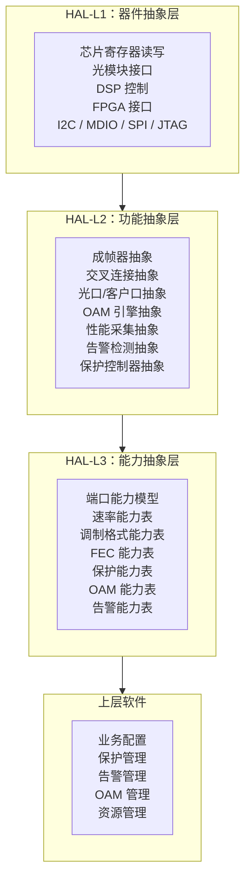

# OTN 嵌入式软件系列 ①：硬件抽象层——把硬件差异压到边界里

OTN 设备里没有"统一硬件"。

同一台设备可能混插不同代次的板卡。同一块板卡可能搭载不同型号的芯片。同一颗芯片可能有不同的固件版本。同一个光模块接口可能对接 100 种模块——不同厂家、不同速率、不同调制格式、不同编码类型。

如果这些差异不加控制，会一路污染上层软件：业务配置逻辑里塞满了芯片寄存器判断，保护倒换代码要区分"这是 X 芯片还是 Y 芯片"，网管上一个性能字段在不同单板上有不同含义。

一旦掉进这个坑，系统复杂度会随硬件种类指数级上升。

硬件抽象层的目标，就是堵住这个口子。

> **把硬件差异压缩到系统边界内，不让它向上泄漏。**

---

## 一、OTN 设备里有哪些硬件差异？

先把差异来源看清楚。

### 1. 芯片代次差异

OTN 交叉芯片、成帧芯片、DSP 芯片都在持续迭代。

第一代芯片可能只支持 ODU0/1/2，第二代支持 ODU3/4 和 ODUflex，第三代加入 OSU 和 fgOTN，第四代支持更灵活的颗粒调度。

如果软件直接感知"这是三代芯片，行为是这样的，那是二代，行为是那样的"，上层逻辑就会变成一场灾难。

### 2. 板卡种类差异

一块 OTN 机框里可能有几十种板卡：

```text
线路板：400G / 200G / 100G，相干 / 非相干
客户板：100GE / 10GE / STM-64 / FC / OTU4
交叉板：不同交叉容量、不同冗余模式
时钟板：不同精度、不同同步源
电源板：不同功率
```

每种板卡的硬件能力不同：支持的端口数量、速率范围、交叉层级、保护方式、OAM 能力、功耗模式。

### 3. 光模块差异

同一个 SFP/QSFP/CFP 接口，能插进去的光模块可以千差万别：

```text
速率：1G 到 400G
距离：500m 到数百 km
类型：灰光 / DWDM / CWDM / BIDI / tunable
调制：NRZ / PAM4 / QPSK / QAM
编码：不同 FEC 类型
```

而且同一个槽位插不同模块，设备能力完全不同。

### 4. 固件版本差异

同一块板卡甚至同一颗芯片，可能因为固件版本不同，行为有细微差异：

```text
DSP 固件版本
FPGA 比特流版本
光模块固件版本
控制面协议栈版本
```

这些差异经常是补丁级别的——只修了一个 bug 或增加了一个小特性，但它会影响整个系统的行为。

---

## 二、差异泄漏的后果

如果硬件差异向上泄漏，会发生什么？

### 后果一：业务配置逻辑被硬件细节污染

```
if (chip == CHIP_X_V3 && port_type == CFP2_DCO && module_fw >= 2.1) {
    // 配置参数 A
} else if (chip == CHIP_Y && line_port_speed == 200G) {
    // 配置参数 B
} else if (...) {
    // ...
}
```

这种代码每加一组硬件组合，逻辑复杂度翻倍。一段时间后，没人敢动。

### 后果二：告警和性能含义碎片化

同一个"pre-FEC BER"，在不同芯片上含义可能不同。同一个"OSNR"，不同光模块上报的精度、门限、单位可能不一致。

如果上层软件不做归一化，网管上显示的数字就不可比、不可信。

### 后果三：测试和验证成本爆炸

每增加一种硬件组合，回归测试的排列又变大了。

如果你有 5 种线路板、4 种光模块、3 种芯片——组合数不是 12，而是 5×4×3 = 60 种场景。如果不控制差异边界，每一种都可能出独特 bug。

### 后果四：硬件升级把软件拖进深渊

一颗新芯片上线，理论上只是换一个硬件。但如果上层代码到处散落着对旧芯片的判断逻辑，你会发现"换芯片"变成了"改几百处代码"。

---

## 三、HAL 的设计原则

硬件抽象层的核心思想很简单：

> **上层软件只看到能力模型，不看到具体硬件。**

### 原则 1：按能力建模，不按芯片建模

不要建一个"ChipX_Driver"，而是建一组能力接口：

```text
Framer（成帧器）接口
CrossConnect（交叉连接）接口
OpticalPort（光口）接口
ClientPort（客户口）接口
OamEngine（OAM 引擎）接口
PerformanceCollector（性能采集）接口
AlarmDetector（告警检测）接口
ProtectionController（保护控制器）接口
ClockSync（时钟同步）接口
```

芯片不是对象。芯片实现的能力，才是对象。

### 原则 2：硬件差异只出现在 HAL 内部

上层代码不应该写：

```c
if (is_vendor_x_chip_version_3()) {
    // ...
}
```

HAL 应该做的是：**把差异翻译成统一的能力表达。**

比如一块旧芯片不支持 ODUflex，HAL 对外应该直接上报"该端口能力集：ODU0/1/2/3/4"，上层只看到支持什么、不支持什么，不关心"为什么"。

### 原则 3：能力查询，不是能力假设

上层不要假设"所有线路板都支持 400G"。

应该通过 HAL 提供的能力查询接口获取：

```text
这个端口支持哪些速率？
支持哪些调制格式？
支持哪些 FEC 类型？
支持哪些保护方式？
支持哪些 OAM 功能？
```

这样新硬件上线，HAL 更新能力表，上层不用改一行代码。

### 原则 4：归一化设备状态

HAL 不仅要抽象能力，还要抽象状态。

一个"链路 UP"的状态，在不同硬件上可能有不同的判断条件：

```text
芯片 A：光口检测到光 + 帧同步 FAS 锁定 + FEC 锁 + 无 LOS/LOF
芯片 B：光功率大于阈值 + 帧同步 OK + SerDes locked + 无 LOF
芯片 C：接收信号 OK + FEC lock + 帧对齐 + 无误码过限
```

HAL 要把这些硬件状态统一映射成：

```text
PORT_STATE_DOWN
PORT_STATE_INITIALIZING
PORT_STATE_UP
PORT_STATE_DEGRADED
PORT_STATE_ADMIN_DOWN
```

上层只看到 UP 还是 DOWN，不关心底层判断链路 UP 的判断逻辑。

---

## 四、HAL 的分层策略

一个 OTN 设备的 HAL 不是一层，而是至少三层：



---

### HAL-L1：器件抽象层

最底层。直接操作硬件寄存器、通信接口。

它的职责是：

> **封装具体器件的访问方式，提供统一读写接口。**

```text
芯片寄存器：统一 register_read / register_write
光模块：统一 optics_read / optics_write / optics_get_dom
告警中断：统一 interrupt_register / interrupt_handler
性能寄存器：统一 pm_get / pm_clear
```

这一层负责处理硬件访问的物理细节：总线类型、地址映射、锁机制、访问时序。

### HAL-L2：功能抽象层

把器件操作组合成功能。

比如"配置一条 ODUk 交叉连接"：

```text
L2 的交叉抽象层收到：
  create_xc(odu_id=5, src_port=1, dst_port=2)

内部操作：
  - 查表得物理槽位和芯片
  - 分配芯片交叉资源
  - 配置硬件寄存器
  - 配置 OAM 开销
  - 更新状态
  - 返回结果
```

上层不需要知道芯片之间怎么交叉、寄存器怎么配。

### HAL-L3：能力抽象层

最高层。

向上层提供"这个设备能做什么"的信息。

```text
端口能力：
  端口 1/1/1：速率 10G/100G/200G/400G，调制 QPSK/QAM16，FEC SDFEC/OFEC

交叉能力：
  支持 ODU0/1/2/3/4/flex，交叉颗粒 ODUk/ODUflex，容量 12.8T

保护能力：
  支持 1+1 SNCP、1:1、ring protection
```

这一层的关键是**用声明式能力代替命令式逻辑**。上层不问"你是不是芯片 X"，只问"你能不能做这件事"。

---

## 五、几个关键设计决策

### 决策 1：能力模型放哪里？

**错误方式：** 把能力硬编码在上层代码里。

```text
错误：
if (line_card_type == LC_400G_V2) {
   capabilities |= CAP_ODUFLEX;
}
```

这等于把 HAL 的职责又搬回上层了。

**正确方式：** 能力由 HAL 上报，上层只消费。

```text
HAL 初始化时：
  读取板卡 EEPROM
  读取芯片 ID
  读取光模块 ID
  组合生成完整能力表
  上报上层

上层：读取能力表，决定配置选项
```

### 决策 2：光模块的数据如何处理？

光模块是个特殊设备。

它有自己的固件、寄存器、状态机、告警，而且不同厂家的模块行为不完全一致。

HAL 对光模块应该做差分化处理：

```text
通用属性（所有模块都有）：
  温度、电压、偏置电流、发射功率、接收功率
  → HAL 统一归一化上报

特殊属性（部分模块有）：
  CDR 锁状态、自适应均衡器参数、链路训练状态
  → HAL 以可选字段方式上报

特有功能（特定模块才有）：
  tunable 波长调节、链路诊断、链路训练
  → HAL 通过能力查询告知上层是否支持
```

上层发起操作之前，先查 HAL："这个模块支持 tunable 吗？"支持才给用户展示调波长的选项。

### 决策 3：性能数据如何归一化？

不同硬件上报性能数据的方式差异很大：

```text
芯片 A：15 分钟周期，历史 33 个 bucket
芯片 B：1 分钟周期，历史 96 个 bucket
芯片 C：实时计数器，无历史 bucket
光模块 D：只有当前值，无历史，无门限
```

HAL 的性能采集层应该统一对外提供：

```text
当前值（实时）
15 分钟历史（标准周期）
24 小时历史（标准周期）
门限状态（正常 / 劣化 / 超限）
```

如果硬件不支持 15 分钟周期，HAL 内部自己攒。上层只看到"15 分钟性能数据"，不关心硬件怎么实现的。

---

## 六、常见错误

### 错误一：HAL 做得太薄

只是把寄存器操作封装了一层，没有真正抽象。

```c
// 这不是 HAL，这是寄存器操作的 wrapper
void hal_set_port_speed(int port, int speed) {
    chip_write(CHIP_SPEED_REG(port), speed);
}
```

这层 wrapper 没有提供真正的抽象价值。上层仍然需要知道speed 参数的编码方式、不同芯片支持哪些 speed。

真正的 HAL 应该是：

```c
// 这才是 HAL
int hal_port_config(port_id_t port, port_config_t *cfg) {
    // 1. 查能力表，验证 cfg->speed 是否支持
    // 2. 查当前状态，验证是否可以配置
    // 3. 根据硬件类型选择配置路径
    // 4. 配置硬件
    // 5. 验证配置结果
    // 6. 返回
}
```

### 错误二：HAL 做得太厚

把本该属于上层的逻辑塞进了 HAL。

HAL 不应该做：

```text
业务路径计算
保护策略选择
告警相关性判断
资源规划
```

HAL 管的是"这个硬件能做什么，怎么让硬件做"，不管"业务应该怎么走、保护应该怎么选"。

### 错误三：抽象过头，丢了关键差异

不是所有差异都能被隐藏。

比如：

```text
芯片 A 的交叉是严格无阻塞，芯片 B 在特定场景下会阻塞
芯片 A 的保护倒换是 50ms，芯片 B 是 80ms
光模块 A 支持链路训练，光模块 B 不支持
```

这些差异如果被 HAL 强行抹平，上层可能做出错误决策。

正确做法是：**差异如果影响 SLA 或选择决策，必须转化为能力字段上报，而不是隐藏。**

---

## 七、HAL 的测试策略

HAL 是离硬件最近的一层，测试无法只用纯软件模拟。

### 测试金字塔

```text
                  /\
                 /  \   硬件在环测试
                /    \  （真实板卡 + 自动化用例）
               /------\
              /        \  硬件仿真测试
             /          \ （FPGA 仿真 / chip simulator）
            /------------\
           /              \  HAL 单元测试
          /                \（mock 寄存器接口 + 逻辑验证）
         /--------------------\
```

**单元测试：** mock 底层寄存器读写，验证 HAL 的状态机、配置事务、错误处理。
**仿真测试：** 在 chip simulator / FPGA 平台上跑，验证真实硬件时序下的行为。
**硬件在环测试：** 真实板卡 + 真实光模块 + 真实链路，自动化覆盖所有接口和配置组合。

OTN 的 HAL 测试有一个特殊性：光模块、DSP、激光器等光学器件的行为，软件模拟不了。很多问题只能在真实光信号下暴露。

---

## 八、HAL 与创新的关系

HAL 做好了，不只是代码质量好。它直接影响设备的演化能力。

### HAL 好 → 新硬件上线快

新芯片上线，只需要改 HAL-L1 和 HAL-L2 的实现，HAL-L3 上报新能力，上层逻辑不需要动。

**从几个月变成几周。**

### HAL 好 → 测试范围可控

新硬件只影响 HAL 内部，上层回归测试不需要覆盖所有硬件组合。

**测试成本从乘法变成加法。**

### HAL 好 → 创新可以发生在硬件，软件不拖后腿

硬件团队想引入新光模块、新调制格式、新 FEC——软件不是阻力。

**HAL 把硬件创新和软件解耦。**

而这一点，在 OTN 领域比互联网软件重要得多。因为 OTN 设备的硬件演进是持续的：相干 DSP 从 100G 走到 400G 再到 800G，光模块从灰光走到 DWDM 再到 tunable，交叉芯片从 ODUk 走到 ODUflex 再到 OSU。

每一代硬件的差异，如果都要拉上层软件一起改，系统永远在重构。

> **HAL 是 OTN 设备软件大厦的地基。地基裂了，上面盖多少层都稳不住。而一个好地基的标志是：上面的楼层感觉不到地基下面的地质差异。**

---

*这是 OTN 嵌入式软件系列的第一篇。下一篇：状态机体系。*

*用到的思维框架：硬件抽象、压缩、分层架构、系统边界、能力模型。*
