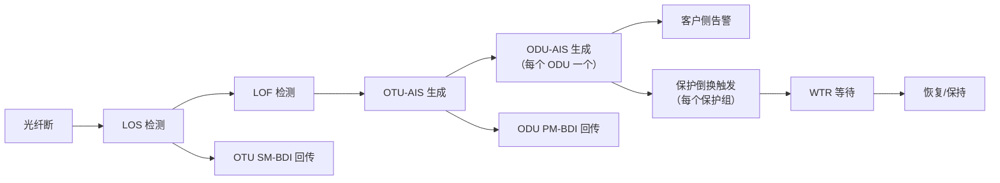

# OTN 嵌入式软件系列 ②：状态机体系——如何让复杂状态仍然可预测

如果 OTN 嵌入式软件有一张骨架，它不是代码结构，不是模块划分，也不是数据结构——是状态机。

不是因为状态机高级，而是因为**设备上几乎所有东西都带状态**，而且这些状态会互相触发、互相等待、互相打断。

处理不好，最轻的症状是"重启一下就好了"。重的，是保护倒换没倒、业务闪断但查不出原因、主备切了但状态不一致。

> **OTN 状态机体系的核心问题不是 "怎么画状态图"，而是 "如何让几十个互相纠缠的状态机，叠加之后仍然可预测"。**

---

## 一、OTN 设备里有多少状态机？

先看清楚范围。

### 1. 告警状态机

OTN 每一层都有独立的告警检测状态机：

```text
物理光层：LOS / OCH-LOS
OTU 层：LOF / OOF / LOM / OTU-AIS / SM-TIM / SM-BDI / SM-BIP
ODU 层：ODU-AIS / ODU-OCI / ODU-LCK / PM-TIM / PM-BDI / PM-BIP / PM-DEG
OPU 层：PT 不匹配 / PSI 错误
客户侧：CSF / ETH-LOS / ETH-LINK-DOWN
```

每个告警有自己的检测机制、去抖窗口、确认时间、恢复判断。

而且这些告警之间有因果关系：

```text
LOS → LOF → OTU-AIS → ODU-AIS → 客户侧告警
```

### 2. 保护倒换状态机

保护倒换是 OTN 最经典的状态机之一：

```text
正常状态
倒换状态
等待恢复（WTR）
锁定状态
强制倒换
人工倒换
练习倒换
冻结状态
```

每个保护组独立一个状态机实例。一台设备可能有上千个保护组同时运行。

而且保护状态要和告警状态联动：

```text
检测到故障 → 触发倒换
故障恢复 → 启动 WTR 定时器
WTR 到期 → 执行恢复
恢复失败 → 保持倒换状态
```

### 3. 板卡状态机

每块板卡从插进去到正常工作，要经过一系列状态：

```text
不在位
在位未上电
上电中
初始化中
配置中
正常运行
故障
降级运行
拔出中
```

中间任何一步都可能失败。而且板卡状态变化会引发连锁反应：

```text
线路板故障 → 所有经过它的业务受影响 → 保护倒换
交叉板故障 → 整机交叉受影响 → 业务全量倒换
时钟板故障 → 时钟源切换 → 全网同步受影响
```

### 4. 链路状态机

OTN 链路从无光到业务正常，要经历多层状态：

```text
光口 LOS → 收到光 → 帧同步 → FEC 锁 → ODU 路径通 → 客户侧 UP
```

每一层有独立状态。而且链路状态不是二值的：

```text
DOWN：完全不通
INITIALIZING：正在建立
UP：正常
DEGRADED：有误码但未断
PARTIAL：部分 ODU 通部分不通
ADMIN_DOWN：人为关闭
```

### 5. 主备状态机

主控板、交叉板、时钟板、电源板都有主备关系：

```text
主用
备用
选举中
同步中
降级
切换中
隔离
```

主备状态的变化会引发大量下游状态迁移：配置同步、业务保护、告警上报通道、网管会话。

### 6. 其他

还有更多：

```text
通道状态（配置/未配置/激活/锁定/测试）
时钟同步状态（自由运行/锁定/保持/失锁）
FEC 状态（锁定/失锁/降级）
软件升级状态（正常/下载/激活/提交/回退）
热插拔状态（插入/拔出过程）
风扇/电源/温度管理状态
```

---

## 二、OTN 状态机的四个特殊难点

### 难点一：状态不是独立的

这是最核心的问题。

一条光纤断了之后的状态链：



这不是一个状态机，而是一整条因果链上多个状态机的联动。

如果你把每个告警当成独立事件处理——各管各的状态——你会发现：
- 同一个根因触发了十几个状态变化
- 这些变化有时间先后
- 中间状态可能触发不该触发的动作
- 恢复时顺序反过来，中间又有很多瞬时状态

### 难点二：瞬态和抖动

物理世界不是干净的数字信号。

```text
光功率抖动
瞬时误码
板卡接触不良
光模块温度波动
电源短暂扰动
时钟短暂失锁
保护倒换过程中的瞬时状态
WTR 定时器窗口内的状态不确定性
```

如果状态机对每个瞬时事件都响应，系统就会振荡。

一个典型的保护倒换振荡：

```text
线路瞬时误码 → 触发倒换 → 倒换完成 → 误码消失 → 启动 WTR → 
WTR 到期 → 恢复 → 恢复过程触发瞬时误码 → 又触发倒换 → ...
```

如果不设计去抖和防振荡机制，系统会在两个状态之间来回跳。

### 难点三：中间状态和部分状态

很多状态迁移不是原子的。

```text
一条 ODU 路径上有 10 个 ODUk 通道
其中一个断了
→ 路径状态是"部分 UP"还是"DOWN"？

一块板卡上有 4 个端口
其中 1 个故障
→ 板卡状态是"正常"还是"降级"？

主备切换过程中
配置同步到一半
→ 备用板状态是"同步中"还是"可用"？
```

现实中的状态很少是干净的 0 或 1。大量中间状态需要被正确定义和处理。

### 难点四：多层级状态的同步问题

OTN 是分层网络，状态在多层之间传播：

```text
光层状态变化 → OTU 层状态变化 → ODU 层状态变化 → 客户层状态变化 → 业务状态变化
```

每一层有自己的检测周期、去抖窗口、恢复逻辑。如果各层的时间参数不一致，可能出现：

```text
光层已经恢复正常了
OTU 层还在告警
ODU 层已经开始恢复流程
保护倒换处于中间状态
```

这就是"分层状态的时间错位"。

---

## 三、状态机设计原则

### 原则 1：状态必须是穷举且互斥的

这个原则看起来很简单，但执行起来很难。因为真实设备上的状态，经常有灰色地带。

一个端口，能不能同时是"UP"和"DEGRADED"？

如果 DEGRADED 是 UP 的子状态，那可以。如果它们是平级状态，就不行。

好的做法是为每个状态对象定义**严格的状态集合**：

```text
端口运行状态：
  DOWN
  INITIALIZING
  UP
  DEGRADED     ← 这是 UP 的子状态，前提是有误码但未中断
  ADMIN_DOWN
  TESTING
  FAILED

这些状态之间不能同时为真。
```

如果有信息说"端口通着但有误码"，那不是两个状态，而是**一个 DEGRADED 状态附加一个误码计数属性**。

### 原则 2：状态迁移必须是显式的

不允许默默改状态。

每个状态迁移必须：

```text
1. 有明确的触发条件
2. 有明确的源状态和目标状态
3. 有迁移过程中的动作
4. 有迁移后的验证
5. 有失败回退路径
6. 记录状态迁移日志
```

隐式状态修改是 OTN 软件里最难查的 bug 来源。

一个常见反例：

```c
// 危险：在函数内部直接改状态
void handle_error(int port_id) {
    port_state[port_id] = STATE_DOWN;  // 谁改的？什么条件？有没有检查？
}

// 安全：通过统一入口迁移
int port_state_transition(int port_id, port_state_t target, event_t trigger) {
    // 1. 验证当前状态是否允许迁移到 target
    // 2. 执行迁移动作
    // 3. 验证结果
    // 4. 记录日志
    // 5. 通知状态变化
}
```

### 原则 3：状态机之间要靠事件通信，不靠状态查询

一个状态机不要直接读另一个状态机的内部状态做决策。

```text
错误：保护倒换代码里直接读告警状态变量
if (alarm_state[port] == ALARM_LOS) {
    trigger_protection_switch();
}

正确：保护倒换订阅告警事件
告警检测状态机检测到 LOS → 发送 ALARM_LOS_EVENT
保护倒换状态机收到事件 → 根据事件和当前保护状态决策
```

关键区别：

- 读状态 = 两个状态机紧耦合，时序依赖
- 收事件 = 两个状态机通过事件总线解耦，各自独立

事件里带上时间戳、序列号、触发原因，接收方可以根据自己的状态决定要不要处理。

### 原则 4：定义好"不知道"状态

系统的真实状态不总是已知的。

```text
初始化阶段：状态未知
主备切换后：状态同步中
通信中断：无法获取状态
损坏数据：状态不可信
```

如果代码里给"未知"赋了一个默认值（比如默认是 DOWN），很多 bug 就藏进去了。

正确做法是显式定义 UNKNOWN 状态：

```text
状态 = DOWN / UP / DEGRADED / UNKNOWN

UNKNOWN 的含义：当前无法确定真实状态，需要进一步查询或等待。
UNKNOWN 不是 DOWN。在 UNKNOWN 状态下，不能触发保护倒换。
```

---

## 四、去抖、防振荡与时间参数

### 去抖

去抖解决的是"瞬时变化不应被当成事件"。

OTN 里的典型去抖场景：

```text
告警去抖：LOS 持续 100ms 才上报，波动小于 50ms 忽略
恢复去抖：LOS 消失后持续 10s 无复发，才确认恢复
性能劣化去抖：BER 连续 3 个 15 分钟周期超门限，才上报告警
保护倒换去抖：故障确认后才启动倒换，防止瞬时误码触发
```

去抖的基本模式：

```text
信号变化 → 启动去抖定时器
  ├─ 定时器到期前信号恢复 → 取消定时器，不产生事件
  └─ 定时器到期信号未恢复 → 确认变化，产生事件
```

### 防振荡

防振荡解决的是"两个状态之间来回跳"。

核心机制——滞回：

```text
触发告警的门限：BER > 10^-6
恢复告警的门限：BER < 10^-7

两个门限之间有差距（滞回带），防止在边缘来回跳。
```

保护倒换里的防振荡：

```text
WTR 定时器：故障恢复后不是立即倒回去，而是等 5-10 分钟。
如果 WTR 期间再次故障 → 取消恢复，保持当前状态。
```

### 时间参数的层级一致性

OTN 各层有各自的定时参数：

```text
光层检测周期：微妙级
OTU 层 OOF 去抖：毫秒级
ODU 层 AIS 检测：毫秒级
保护倒换：50ms 内
WTR：分钟级
性能劣化检测：15 分钟级
```

这些时间参数如果设计不好，会产生时序漏洞。

一个常见的时序问题：

```text
保护倒换在 50ms 内完成
但 ODU-AIS 的去抖窗口是 100ms

→ 保护倒换在 AIS 确认之前就触发了
→ 保护倒换的依据是什么？
```

所以状态机的时间参数必须分层统一设计，不能各自为政。

---

## 五、状态机的测试策略

状态机是最难测的东西之一，因为 bug 通常不在单个状态机里，而在多个状态机的交互和时序中。

### 测试方法一：状态覆盖

对单个状态机，要覆盖：

```text
所有合法迁移路径
所有非法迁移尝试（应该被拒绝）
所有边界状态（UNKNOWN 状态下的行为）
所有隐式迁移（状态机之外是否有代码偷偷改状态）
```

### 测试方法二：因果链测试

对 OTN 最关键的测试是因果链：

```text
模拟光纤断 → 检查：
  LOS 是否在去抖窗口后上报？
  LOF 是否在 LOS 后正确检测？
  OTU-AIS 是否正确生成？
  ODU-AIS 是否正确生成？
  保护倒换是否在时间内触发？
  倒换完成后业务是否恢复？
  
恢复光纤 → 检查：
  WTR 是否启动？
  WTR 到期后是否恢复？
  恢复过程是否无振荡？
  所有中间告警是否正确清除？
```

### 测试方法三：竞态注入

人为引入时序不确定性，暴露竞态：

```text
在状态 A 到 B 的迁移过程中，注入另一个事件 C
在告警去抖窗口中间，注入另一个告警
在保护倒换执行过程中，注入主备切换
在 WTR 定时器运行中，注入新的故障
```

OTN 里最隐蔽的 bug 经常出在"过程中又来一个事件"。

### 测试方法四：长时间 soak 测试

有些问题只出现在特定状态序列之后：

```text
连续跑 1000 次保护倒换 + 恢复
连续跑 10000 次板卡热插拔
连续跑 100 次主备切换
在随机时间点注入故障，跑 72 小时
```

目的不是测单次正确性，而是测系统在长期运行后状态有没有漂移。

---

## 六、几个实战反例

### 反例一：隐形状态

```c
// "这个端口是 UP 还是 DOWN？"
// 代码里没有一个 port_state 变量
// 而是看三个不同字段的组合来判断：
//   link_up == 1
//   alarm_count == 0
//   admin_down == 0
// → 没有显式状态，每次判断都要读三个变量
```

正确做法：维护一个显式的 port_state，由状态机统一管理。其他代码只读这个状态。

### 反例二：跨层读状态

```c
// 保护倒换代码里
if (odu_alarm[odu_id] == ALARM_AIS) {
    // ...
}
// 直接读 ODU 层的告警状态做决策
```

正确做法：保护倒换状态机只订阅事件，不读其他状态机的内部状态。

### 反例三：没有定义"恢复路径"

```c
// 告警来了 → 触发倒换 → 倒换成功
// 告警恢复了 → ？？？
// 代码里没有定义恢复流程
```

每个状态迁移的逆迁移必须显式定义。进去有路，出来也要有路。

---

## 总结

OTN 设备嵌入式软件里，状态机不是锦上添花——它是骨架。

因为 OTN 设备的本质就是：

> **在不确定的物理世界里，为每一个设备对象维持一个确定的状态，并让状态之间的因果传播可预测、可控制、可恢复。**

这一篇的核心要点：

```text
1. OTN 设备里有大量状态机：告警、保护、板卡、链路、主备、时钟、升级……
2. 真正的难点不是单个状态机，而是多个状态机叠加后的可预测性
3. 核心原则：状态穷举互斥、迁移显式、FSM 之间靠事件解耦、显式定义 UNKNOWN
4. 去抖、防振荡、时间参数一致性是 OTN 特有的工程问题
5. 测试重点在因果链、竞态注入、长时间 soak
6. 每个状态迁移必须定义恢复路径
```

> **状态机的质量，不是看它正常工作时的效率，而是看它在异常叠加时，还剩下多少可预测性。**

---

*这是 OTN 嵌入式软件系列的第二篇。下一篇：配置事务系统。*

*用到的思维框架：状态机、分层时序、事件解耦、因果链、系统预测性。*
