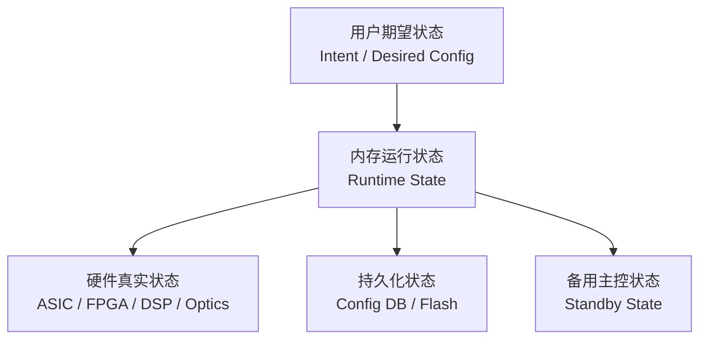
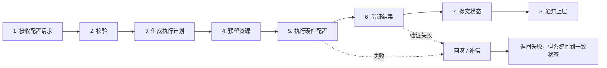
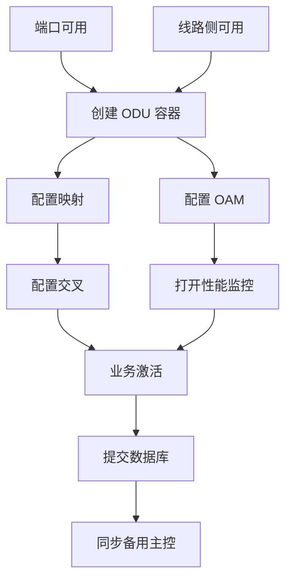
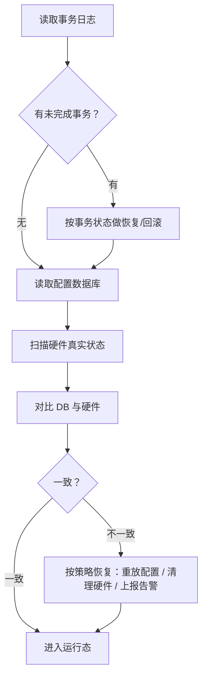

# OTN 嵌入式软件系列 ③：配置事务系统——如何保证配置一致、可回滚、可恢复

OTN 设备上最容易被低估的一类软件问题，是配置。

从外面看，配置好像只是用户点一下：

```text
创建一条 A 端口到 B 端口的业务
```

但在设备内部，这绝不是一次简单的函数调用，也不是写一个寄存器。

一条 OTN 业务配置，可能同时涉及：

```text
客户侧端口
OPU 映射
ODU 容器
ODUflex / OSU 颗粒
交叉连接
OTU 线路侧
OAM 开销
TTI / BIP / BDI / AIS
性能统计
告警抑制
保护组
配置数据库
主备同步
硬件寄存器
```

任何一步失败，都可能留下半配置状态。

> **配置事务系统的核心问题，不是“如何把配置下发到硬件”，而是“如何保证配置在数据库、内存状态、硬件状态、主备状态之间一致，并且失败后可回滚、重启后可恢复”。**

---

## 一、为什么 OTN 配置不是一次写寄存器？

先看一个简单例子：创建一条 10GE 到 ODU2 的业务。

表面上是：

```text
客户侧 10GE → ODU2 → 交叉 → OTU4 线路侧
```

设备内部可能要做：

```text
1. 检查客户端口是否在位、速率是否匹配
2. 检查线路侧 OTU4 是否可用
3. 分配 OPU/ODU 资源
4. 建立 ODU2 容器
5. 配置 GFP / BMP / AMP / GMP 等映射方式
6. 配置 ODU 交叉连接
7. 配置路径层 PM 开销
8. 配置 TTI
9. 打开 BIP / BEI / BDI 统计
10. 配置告警检测和告警抑制规则
11. 配置性能采集周期
12. 如果有保护，加入保护组
13. 写硬件寄存器
14. 更新内存资源表
15. 更新配置数据库
16. 同步备用主控
17. 上报配置成功事件
```

这里有一个关键点：**这十几步不是独立的。**

中间任何一步失败，都会影响后续状态。

比如：

```text
ODU 资源分配成功
交叉连接配置成功
OAM 配置失败
数据库还没写
```

这时候设备到底算配置成功，还是失败？

如果失败，前面已经写进硬件的交叉连接要不要撤销？

如果设备此时重启，启动后看到硬件里有交叉，但数据库里没有配置，该相信谁？

这就是配置事务系统要解决的问题。

---

## 二、OTN 配置里有四种状态

很多配置系统出问题，是因为只认为自己有一种状态：配置状态。

实际上，OTN 设备至少有四种状态。



### 1. 用户期望状态

用户想要什么：

```text
我要创建一条业务
我要删除一条业务
我要修改保护方式
我要关闭一个端口
```

这是意图。

### 2. 内存运行状态

软件当前认为系统是什么样：

```text
端口是否可用
资源是否已分配
业务是否已激活
状态机当前处于什么状态
```

这是设备运行时的大脑。

### 3. 硬件真实状态

硬件寄存器、芯片表项、DSP 状态、光模块状态里真实存在的东西。

这里最麻烦：软件以为写成功了，不代表硬件真的生效了。

### 4. 持久化状态

设备重启后靠它恢复配置。

如果数据库和硬件不一致，重启就是一次大冒险。

### 5. 备用主控状态

主备系统里，备用主控必须知道当前配置和运行状态。否则主备倒换后，它接不住。

所以配置事务的本质是：

> **让这几种状态按明确顺序变化，并在失败时回到一个可解释状态。**

---

## 三、配置失败最怕什么？半配置

所谓半配置，就是系统处在一种谁也说不清的状态。

```text
数据库认为业务不存在
硬件交叉表里业务存在
内存资源表认为资源已占用
备用主控不知道这条业务
网管页面显示创建失败
但客户侧业务偶尔有流量
```

这比明确失败更可怕。

明确失败很好处理：告诉用户失败，资源没占用，硬件没变化。

半配置最麻烦：

```text
删不掉
建不了
查不到
复现不了
重启后状态变了
主备倒换后又变了
```

OTN 设备上很多“玄学问题”，本质都是半配置状态留下来的。

---

## 四、配置事务的基本流程

一个可靠的配置事务，至少要经过七步。



### 1. 接收配置请求

用户请求不能直接下硬件。

先转成内部统一配置对象：

```text
CREATE_SERVICE
  service_type = ODU2
  src = client_port_1/1/1
  dst = line_port_1/2/1
  mapping = GMP
  protection = none
```

### 2. 校验

校验分两类。

**静态校验：** 参数是否合法。

```text
速率是否支持？
端口类型是否匹配？
ODU 颗粒是否合法？
配置字段是否完整？
```

**动态校验：** 当前状态是否允许。

```text
端口是否空闲？
资源是否足够？
板卡是否在位？
线路侧是否 UP？
是否有冲突业务？
保护组是否允许加入？
```

### 3. 生成执行计划

不要边想边配。

先把配置拆成一张操作计划：

```text
Step 1: 分配 ODU2 资源
Step 2: 配置客户侧映射
Step 3: 配置线路侧 ODU
Step 4: 配置交叉连接
Step 5: 配置 OAM / TTI
Step 6: 打开 PM 统计
Step 7: 更新数据库
Step 8: 同步备用主控
```

计划生成之后，才执行。

这样失败时才知道已经执行到哪一步，该逆向撤销哪些步骤。

### 4. 预留资源

预留和提交要分开。

预留的意思是：

```text
我先把资源锁住，防止并发配置抢走。
但此时用户配置还没正式生效。
```

比如两个用户同时创建业务，都要抢同一个 ODU timeslot。如果没有预留机制，就可能出现并发冲突。

### 5. 执行硬件配置

按计划写硬件。

这一步必须考虑硬件异步性：

```text
写寄存器成功 ≠ 硬件生效
硬件生效 ≠ 信号稳定
信号稳定 ≠ 业务可用
```

所以不能只看 write 返回值。

### 6. 验证结果

验证非常关键。

```text
交叉表项是否真的存在？
ODU 是否真的激活？
帧是否同步？
OAM 是否正常？
告警是否符合预期？
性能计数是否开始工作？
```

没有验证，配置系统就是“我以为成功”。

### 7. 提交状态

验证成功后，才正式提交：

```text
更新内存运行状态
写配置数据库
同步备用主控
释放事务锁
上报成功事件
```

这一步之后，配置才算真正成功。

---

## 五、先写数据库，还是先写硬件？

这是配置事务系统绕不开的问题。

### 方案一：先写数据库，再写硬件

优点：

```text
重启后能看到用户配置
配置意图不会丢
```

缺点：

```text
硬件配置失败时，数据库里已有配置
容易出现“数据库有，硬件没有”
```

### 方案二：先写硬件，再写数据库

优点：

```text
只有硬件成功才写数据库
避免数据库虚假成功
```

缺点：

```text
硬件成功后、数据库写入前如果重启
会出现“硬件有，数据库没有”
```

### 更好的做法：事务日志 + 两阶段状态

不要只靠“先写谁”。

正确做法是引入事务日志：

```text
1. 写事务日志：我要创建业务 X，事务状态 = PREPARED
2. 执行硬件配置
3. 验证硬件结果
4. 写数据库正式配置
5. 更新事务状态 = COMMITTED
6. 清理事务日志
```

如果中途重启，启动恢复流程会检查事务日志：

```text
PREPARED 但未 COMMITTED：
  → 检查硬件是否部分配置
  → 如果有，执行回滚
  → 如果没有，直接清理

COMMITTED 但硬件状态不一致：
  → 按数据库重新恢复硬件配置
```

这就是配置可恢复性的基础。

---

## 六、回滚不是撤销按钮，是补偿动作

很多人以为回滚就是把刚才做的操作反过来执行一遍。

现实没那么简单。

比如：

```text
Step 1: 分配 ODU 资源          → 可释放
Step 2: 配置硬件交叉表项        → 可删除
Step 3: 配置 DSP 参数           → 可能需要等待稳定
Step 4: 触发保护状态变化        → 不能简单撤销
Step 5: 打开告警检测            → 可能已经产生告警
Step 6: 上报事件给上层          → 事件无法收回
```

有些动作可逆，有些动作不可逆，只能补偿。

所以执行计划里每一步都要定义两个动作：

```text
Do：执行动作
Undo / Compensate：失败后的补偿动作
```

例如：

| 动作 | 失败后的处理 |
|---|---|
| 预留资源 | 释放资源 |
| 写交叉表 | 删除交叉表 |
| 打开性能统计 | 关闭性能统计并清计数 |
| 配置 TTI | 恢复原 TTI |
| 触发保护倒换 | 进入人工确认或安全状态，而不是简单倒回 |
| 上报告警 | 不撤销历史告警，只上报恢复/清除 |

> **回滚的目标不是“假装什么都没发生”，而是让系统回到一个一致、可解释、可继续运行的状态。**

---

## 七、配置顺序：依赖图比流程图更重要

复杂配置不能只用线性步骤表达。

它本质上是一张依赖图。



依赖图的好处：

```text
知道哪些步骤可以并行
知道哪些步骤必须等待
知道失败时回滚顺序
知道恢复时重放顺序
```

如果只写成一串流程，后期一加功能，顺序就会被各种 if-else 打乱。

---

## 八、并发配置：事务锁怎么设计？

OTN 设备可能同时收到多个配置请求：

```text
用户创建业务 A
网管删除业务 B
保护组修改成员
板卡热插拔触发资源刷新
主备同步正在进行
```

如果没有锁，会出现资源冲突。

但如果全局一把大锁，系统并发能力很差。

### 粗粒度锁

```text
整机配置锁
整板配置锁
整业务配置锁
```

优点：简单。缺点：阻塞严重。

### 细粒度锁

```text
端口锁
ODU 资源锁
交叉资源锁
保护组锁
光模块锁
```

优点：并发高。缺点：容易死锁。

### 实用做法：按资源树加锁

先定义资源树：

```text
NE
 ├─ Shelf
 │   ├─ Slot
 │   │   ├─ Board
 │   │   │   ├─ Port
 │   │   │   ├─ ODU Resource
 │   │   │   └─ Cross Resource
 │   └─ Protection Group
 └─ Global Clock / Control Plane
```

加锁原则：

```text
1. 永远按固定顺序加锁：从上到下，从小 ID 到大 ID
2. 能锁局部就不锁全局
3. 锁持有时间尽量短
4. 硬件等待过程不要长时间持锁
5. 所有锁操作要有超时和日志
```

---

## 九、重启恢复：设备醒来后相信谁？

设备重启后，软件面对三个来源：

```text
配置数据库：我记得用户想要什么
硬件状态：我现在真实配成什么样
事务日志：上次死在什么阶段
```

启动恢复的顺序应该是：



这里最忌讳的是默认相信某一方。

```text
只相信数据库 → 可能覆盖硬件真实状态
只相信硬件 → 可能丢掉用户配置意图
只相信内存 → 重启后内存已经没了
```

真正可靠的恢复，是三方对账。

---

## 十、主备同步：备板不是数据库备份

主备系统里，备用主控不是简单保存一份配置文件。

它必须能在主控倒下后接管正在运行的设备。

所以同步内容至少包括：

```text
已提交配置
未完成事务
资源占用状态
状态机关键状态
保护组当前状态
告警当前状态
性能统计基线
版本兼容信息
```

但也不是所有状态都应该同步。

例如：

```text
临时定时器计数
局部瞬时状态
硬件访问临时变量
未确认的中间事件
```

这些同步过去反而可能制造错误。

主备同步的原则：

> **同步能帮助备用主控接管的状态，不同步只属于当前执行线程的临时状态。**

主备切换后，备用主控应该做一次轻量级 reconciliation：

```text
读取配置数据库
检查硬件关键表项
校验资源占用
恢复状态机
重新订阅告警和性能事件
```

不能假设“同步过来的一定正确”。

---

## 十一、配置事务系统的常见错误

### 错误一：把配置和生效混为一谈

用户下发成功，不等于业务生效。

```text
配置成功：系统接受并写入配置
硬件成功：硬件寄存器配置完成
业务生效：链路正常、OAM 正常、无阻断告警
SLA 满足：性能指标达到要求
```

这四个状态不能混成一个“成功”。

### 错误二：没有事务 ID

没有事务 ID，就无法追踪一次配置经过了哪些模块。

每次配置应该生成一个 transaction_id，贯穿：

```text
北向请求
资源分配
硬件配置
日志
告警
数据库
主备同步
```

出了问题，用 transaction_id 串起整条链。

### 错误三：回滚路径没人测

很多系统只测成功路径。

但 OTN 设备真正出问题，经常是在失败路径：

```text
Step 4 失败，前 3 步能不能撤干净？
回滚过程中又失败怎么办？
回滚到一半主备切换怎么办？
回滚时板卡被拔了怎么办？
```

失败路径不测，事务系统等于没有。

### 错误四：配置恢复顺序不确定

重启恢复时，如果配置重放顺序不稳定，问题会非常隐蔽。

比如先恢复业务，再恢复保护组；或者先恢复保护组，再恢复业务，结果可能不同。

恢复顺序必须由依赖图决定，不能靠配置文件读取顺序。

---

## 十二、测试策略

配置事务系统的测试重点不是“能不能配置成功”，而是“失败后系统是否一致”。

### 1. 成功路径测试

```text
创建业务
删除业务
修改业务
加入保护组
移出保护组
重启恢复后业务仍在
主备切换后业务仍在
```

### 2. 失败点注入

在每一步人为制造失败：

```text
资源分配失败
硬件写失败
硬件写成功但验证失败
数据库写失败
主备同步失败
配置过程中板卡拔出
配置过程中主备切换
配置过程中设备重启
```

每个失败点都检查：

```text
资源是否释放？
硬件是否清理？
数据库是否一致？
事务日志是否可恢复？
是否上报正确错误？
```

### 3. 重启恢复测试

在事务每个阶段断电重启：

```text
PREPARED 后重启
硬件配置一半后重启
硬件配置完成但数据库未写后重启
数据库写完但事务未提交后重启
提交后重启
```

启动后必须回到可解释状态。

### 4. 并发冲突测试

```text
两个用户同时配置同一端口
创建业务时删除相关端口
修改保护组时触发保护倒换
配置过程中板卡热插拔
```

目标是验证锁和事务隔离。

---

## 总结

OTN 配置事务系统的本质，是在多个状态之间建立一致性：

```text
用户期望状态
内存运行状态
硬件真实状态
持久化状态
备用主控状态
```

配置事务的目标不是“让配置成功”，而是：

> **成功时，所有状态一起成功。失败时，系统回到一致状态。重启时，系统能恢复到可解释状态。主备切换时，备用主控能接住。**

这一篇的核心要点：

```text
1. 一条 OTN 业务配置涉及多层对象，不是一次写寄存器
2. 配置系统至少要管理五种状态：期望、运行、硬件、持久化、主备
3. 半配置比失败更可怕
4. 事务流程必须包含校验、计划、预留、执行、验证、提交、通知
5. 事务日志比“先写数据库还是先写硬件”更重要
6. 回滚不是撤销按钮，而是补偿动作
7. 配置顺序应该由依赖图决定
8. 重启恢复要做数据库、硬件、事务日志三方对账
9. 主备同步不是简单备份配置文件
10. 测试必须覆盖失败点、重启点、并发冲突点
```

> **好的配置系统，用户看起来很简单；工程师知道，简单背后是一整套防止系统进入半配置状态的机制。**

---

*这是 OTN 嵌入式软件系列的第三篇。下一篇：告警与故障处理。*

*用到的思维框架：事务系统、一致性、补偿动作、依赖图、状态恢复、主备同步。*
