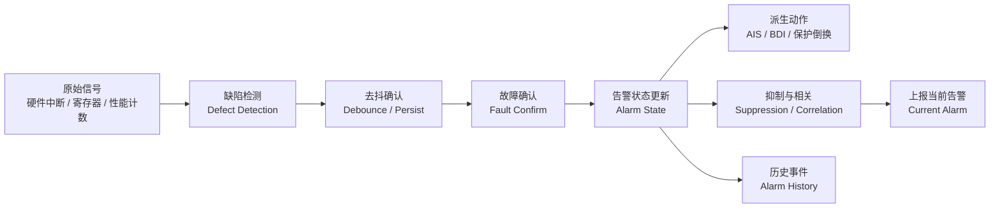
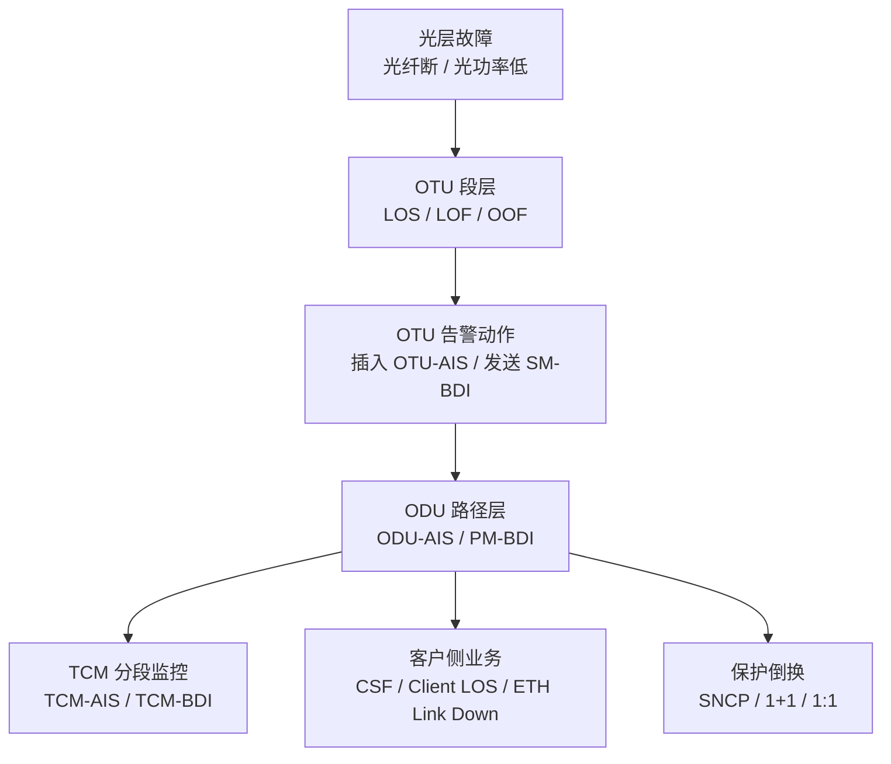
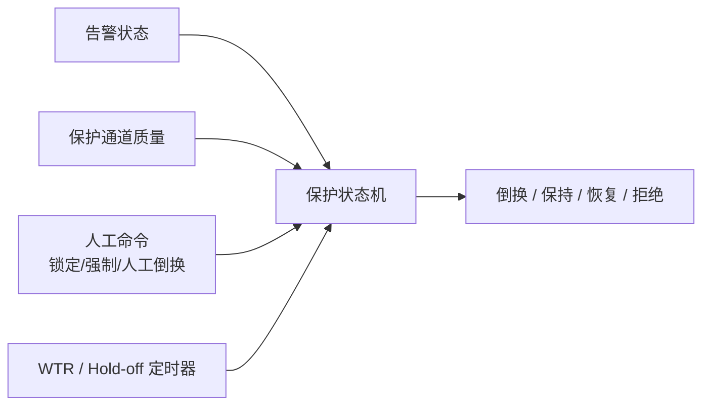

# OTN 嵌入式软件系列 ④：告警与故障处理——从事件上报到故障传播理解

OTN 设备上的告警，不能简单理解成“检测到异常，然后上报一条事件”。

如果只是这样，系统很快就会被告警淹没。

一根光纤断了，设备上可能同时出现：

```text
LOS
LOF / OOF
OTU-AIS
ODU-AIS
PM-BDI
TCM-BDI
客户侧业务告警
保护倒换事件
性能劣化事件
```

如果软件只是把这些东西逐条上报，网管看到的是一场告警风暴；现场工程师看到的是一堆红灯；真正的根因反而被淹没了。

所以 OTN 嵌入式软件里的告警系统，真正要解决的不是“怎么上报告警”，而是：

> **如何把物理故障、协议缺陷、派生告警、保护动作和业务影响组织成一条可解释的故障传播链。**

这篇是 OTN 嵌入式软件系列的第四篇：告警与故障处理。

---

## 一、告警不是事件，是状态

很多系统一开始容易把告警做成事件：

```text
检测到 LOS → 上报 LOS 事件
检测到 LOF → 上报 LOF 事件
检测到 BDI → 上报 BDI 事件
```

这样做很直观，但不够。

因为告警有生命周期：

```text
未发生
疑似发生
确认发生
持续存在
恢复中
确认恢复
清除
```

所以告警本质上不是“某一刻发生的事件”，而是一个**状态对象**。

一个完整告警对象至少应该包含：

```text
告警类型：LOS / LOF / ODU-AIS / PM-BDI ...
告警对象：端口 / OTU / ODU / TCM / 业务
当前状态：active / cleared / suppressed / masked
发生时间：首次检测时间 / 确认时间
恢复时间：首次恢复时间 / 确认清除时间
严重级别：critical / major / minor / warning
根因关系：是否由其他告警派生
动作关系：是否触发 AIS / BDI / 保护倒换
上下文：板卡、端口、业务、保护组、层级、方向
```

事件只是告警状态变化时产生的记录。

```text
告警状态：当前 LOS active
事件记录：10:01:05 LOS raised
事件记录：10:02:30 LOS cleared
```

如果只保存事件，不维护告警状态，系统就无法回答：

```text
当前到底还有哪些故障？
哪个告警是根因？
哪个告警已经恢复？
哪个告警被抑制了？
哪个业务仍然受影响？
```

---

## 二、OTN 告警处理的基本流水线

嵌入式软件里，告警处理不应该是“检测到就上报”，而是一条流水线。



每一层都有自己的职责。

### 1. 原始信号

来自硬件：

```text
光模块 DDM
SerDes lock
FEC lock
帧同步状态
BIP 误码计数
芯片中断
DSP 状态
FPGA 寄存器
```

这些是最低层信号，很多是瞬态的、不稳定的。

### 2. 缺陷检测

Defect 是“检测到异常迹象”。

比如：

```text
连续检测不到光 → dLOS
FAS 失步 → dLOF / dOOF
TTI 不匹配 → dTIM
误码超过门限 → dDEG
```

此时还不一定形成告警。

### 3. 去抖确认

缺陷持续一段时间，才确认成故障。

```text
LOS 持续超过 T1 → 确认故障
LOS 消失持续超过 T2 → 确认恢复
```

T1/T2 不一定相等。恢复时间通常更长，用来防振荡。

### 4. 告警状态更新

确认故障后，更新告警对象状态。

注意：这里不是简单“上报”。而是先更新设备内部的当前告警表。

### 5. 派生动作

有些告警会触发动作：

```text
检测到上游故障 → 下游插入 AIS
检测到接收方向故障 → 反向发送 BDI
检测到工作通道故障 → 触发保护倒换
检测到性能劣化 → 触发预警或保护策略
```

### 6. 抑制与相关

最后才决定哪些告警要显示给上层，哪些只是内部派生状态。

---

## 三、OTN 告警的层级传播

OTN 是分层网络，告警也沿层级传播。

一个光层故障，可能逐层变成 OTU、ODU、客户业务故障。



这张链路说明一个关键点：

> **很多告警不是独立发生的，而是一个根因在不同层级上的投影。**

如果软件不理解层级关系，就会把这些投影当成同等重要的独立告警。

这会带来三个问题：

```text
1. 告警数量爆炸
2. 根因不清楚
3. 保护动作依据混乱
```

---

## 四、根因告警和派生告警

OTN 告警系统最重要的能力之一，是区分根因和派生。

### 一个典型例子

```text
线路侧光纤断
    ↓
线路端口 LOS
    ↓
OTU LOF
    ↓
ODU-AIS
    ↓
多个业务产生客户侧告警
```

这里真正的根因是 LOS。

ODU-AIS 和客户侧告警是真实存在的，但它们不是根因。它们是故障传播到不同层级后的表现。

所以告警系统应该表达成：

```text
根因告警：线路端口 LOS
派生告警：LOF、ODU-AIS、客户侧告警
影响对象：哪些 ODU、哪些业务、哪些保护组
```

而不是把所有告警平铺出来。

### 根因判断不能只靠级别

很多系统用严重级别判断根因：critical 就是根因，minor 就是派生。

这是错的。

根因判断应该靠因果关系，不靠级别。

比如：

```text
PM-TIM 可能只是 major，但它可能是业务错连的根因
ODU-AIS 可能很严重，但它可能是上游 LOS 的派生
```

### 根因判断也不能只靠时间

“先发生的就是根因”也不可靠。

因为不同层的检测周期不同：

```text
ODU-AIS 可能先被软件检测到
LOS 中断事件可能后到达 CPU
```

时间顺序会受硬件中断、轮询周期、去抖参数影响。

正确做法是：

> **用层级因果图 + 时间窗口 + 对象关系共同判断。**

---

## 五、告警抑制：不是简单隐藏

告警抑制经常被误解成“不要上报太多”。

但真正的告警抑制不是隐藏，而是**保持因果关系，只减少噪声**。

### 哪些告警可以抑制？

典型规则：

```text
如果 LOS active，则抑制同一端口上的 LOF/OOF
如果 OTU-AIS active，则抑制下游 ODU 层派生 AIS
如果板卡不在位，则抑制该板卡所有端口告警
如果端口 admin down，则抑制物理层告警
如果业务未配置，则抑制该业务层告警
```

### 抑制不是删除

被抑制的告警仍然应该存在于内部状态里，只是不上报或降低展示优先级。

原因很简单：

```text
1. 根因恢复后，派生告警可能仍未恢复
2. 工程师排障时可能需要完整传播链
3. 保护倒换逻辑可能仍要用到内部派生状态
```

所以正确模型是：

```text
告警状态 = active
展示状态 = suppressed
根因指向 = LOS
```

而不是直接丢掉。

---

## 六、BDI、BEI、AIS：它们不是普通告警

OTN 里有些信号容易被当成普通告警，其实它们更像“故障传播机制”。

### AIS：向下游告知“上游已经坏了”

AIS 的意义是：

```text
我上游已经不可用，所以我给下游插入一个标准缺陷信号。
你不要误以为是自己这里坏了。
```

所以 AIS 是一种故障隔离机制。

它告诉下游：问题来自上游。

### BDI：向反方向告知“你发给我的方向有问题”

BDI 是反向缺陷指示。

```text
我在接收方向发现问题
于是沿反方向告诉对端：你发过来的信号我收得有问题
```

所以 BDI 不能简单理解为“本端故障”。它常常是远端对本端方向的反馈。

### BEI：误码统计的反向反馈

BEI 反映的是远端检测到的误码情况。

它对定位单向劣化特别有用。

例如：

```text
本端看接收方向没问题
但收到远端 BEI 持续增加
说明本端发往远端的方向可能有问题
```

嵌入式软件如果不区分这些语义，就会把故障方向判断错。

---

## 七、性能劣化和硬故障要分开处理

OTN 告警里有两类问题：硬故障和劣化。

### 硬故障

```text
LOS
LOF
LOM
AIS
LCK
OCI
```

这类故障通常是“断了”或“不可用”。动作比较明确：上报告警、触发保护、插入 AIS、发送 BDI。

### 性能劣化

```text
BIP 误码增加
pre-FEC BER 升高
post-FEC BER 接近门限
光功率下降
OSNR 下降
FEC 纠错裕量下降
```

这类问题不是马上断，而是在变差。

它们更适合形成趋势判断：

```text
当前还通
但质量在下降
未来可能故障
需要预警、调参或迁移
```

嵌入式软件里，劣化处理不能和硬故障完全一样。

```text
硬故障：快速确认，快速动作
劣化：窗口统计，趋势判断，门限滞回
```

否则会出现两种错误：

```text
误码轻微抖动就倒换 → 过度敏感
误码长期恶化却不上报 → 失去预警价值
```

---

## 八、告警与保护倒换的关系

保护倒换依赖告警，但不能简单等同于告警。

错误做法：

```text
只要 LOS active，就立刻倒换
只要 LOS clear，就立刻恢复
```

正确做法是：

```text
告警确认 → 故障条件成立 → 保护状态机判断是否满足倒换条件 → 执行动作
```

保护倒换还要考虑：

```text
当前保护状态
工作/保护通道质量
人工锁定
强制倒换
WTR
优先级
保护通道是否可用
是否处于倒换抑制状态
```

也就是说，告警只是保护倒换的输入之一。



这里特别重要的是两个定时器：

```text
Hold-off：故障出现后，延迟一小段时间再倒换，避免瞬态触发
WTR：故障恢复后，等待一段时间再恢复，避免振荡
```

告警系统如果没有和保护状态机协同设计，很容易出现：

```text
告警抖动 → 保护反复倒换
派生告警 → 误触发保护
根因恢复 → 保护过早恢复
```

---

## 九、嵌入式侧应该维护一张故障传播图

OTN 设备软件不一定要做复杂的 AI 根因分析，但至少应该有一张清晰的故障传播图。

这张图回答四个问题：

```text
1. 哪个对象发生了原始缺陷？
2. 这个缺陷向哪些层级传播？
3. 哪些告警是派生的？
4. 哪些业务和保护组受影响？
```

一个简单的数据结构可以是：

```text
FaultNode:
  object_id      // 端口、OTU、ODU、TCM、业务
  layer          // optical / OTU / ODU / OPU / client
  alarm_type     // LOS / LOF / AIS / BDI ...
  state          // active / cleared / suppressed
  root_cause_id  // 指向根因节点
  children[]     // 派生告警节点
  affected_services[]
  actions[]      // AIS / BDI / protection switch
```

这样设备内部就不只是维护“当前告警列表”，而是在维护一个故障传播结构。

这对三个场景特别有价值：

```text
1. 上报告警时，可以标出根因和派生关系
2. 保护倒换时，可以避免派生告警误触发
3. 故障恢复时，可以按传播链逐层清除
```

---

## 十、恢复比发生更难

告警发生时，因果方向通常比较清楚：

```text
根因出现 → 派生告警出现
```

恢复时更复杂：

```text
根因恢复了
派生告警可能还没恢复
保护可能还在倒换状态
WTR 可能还没结束
性能计数可能还在劣化窗口内
客户业务可能还没完全恢复
```

所以恢复不能简单写成：

```text
LOS clear → 清除所有派生告警
```

正确恢复应该是分层确认：

```text
根因清除
  ↓
下游 AIS 消失
  ↓
ODU 路径恢复
  ↓
客户侧业务恢复
  ↓
保护进入 WTR
  ↓
WTR 到期后恢复工作通道
  ↓
确认无振荡
```

恢复链也要可解释。

现场很多“告警清不掉”的问题，根因不是告警系统错，而是恢复链缺了某个确认条件。

---

## 十一、常见错误

### 错误一：告警就是打印日志

告警不是 log。

log 是给工程师看的事件记录。告警是设备当前故障状态的一部分，会影响业务、保护、OAM、网管显示。

### 错误二：只做告警列表，不做因果关系

结果就是告警风暴。

系统知道有 100 条告警，但不知道它们是不是同一个根因。

### 错误三：抑制规则太粗暴

比如“有 LOS 就抑制所有下层告警”。

这可能掩盖真正的二次故障。

抑制应该保留内部状态和因果关系，而不是直接丢弃。

### 错误四：恢复路径没设计

告警发生路径设计得很完整，恢复路径只靠“反向清除”。

现实中恢复路径往往比发生路径更复杂。

### 错误五：把远端告警当成本端故障

BDI、BEI 这类反向反馈信号，如果方向理解错，会导致故障定位完全反了。

---

## 十二、测试策略

告警系统的测试，不能只测“能不能上报”。

### 1. 单告警测试

```text
LOS 触发和恢复
LOF 触发和恢复
TIM 触发和恢复
BDI 触发和恢复
DEG 门限触发和恢复
```

验证去抖、恢复、严重级别、当前告警表、历史事件。

### 2. 因果链测试

模拟一根光纤断：

```text
检查 LOS 是否成为根因
LOF/ODU-AIS/客户侧告警是否被标为派生
AIS/BDI 是否正确插入
保护倒换是否按预期触发
恢复时是否按层级清除
```

### 3. 抖动测试

```text
LOS 50ms 出现又消失
光功率在门限附近来回跳
BER 在 DEG 门限附近波动
```

验证去抖和滞回。

### 4. 并发故障测试

```text
光纤断的同时，板卡拔出
LOS active 时，保护通道也劣化
主备切换过程中出现告警风暴
配置删除过程中告警恢复
```

OTN 设备真正的复杂问题，经常出现在并发故障。

### 5. 长时间告警风暴测试

```text
批量拔纤
批量插纤
反复倒换
批量板卡重启
72 小时随机故障注入
```

检查系统是否出现：

```text
告警丢失
告警不清
内存泄漏
CPU 被告警打满
保护状态异常
主备状态不一致
```

---

## 总结

OTN 嵌入式软件里的告警与故障处理，不是“检测到异常就上报”。

它要做的是：

```text
原始信号
  ↓
缺陷检测
  ↓
去抖确认
  ↓
告警状态
  ↓
故障传播图
  ↓
派生动作：AIS / BDI / 保护倒换
  ↓
抑制、相关、上报、恢复
```

这一篇的核心要点：

```text
1. 告警不是事件，而是有生命周期的状态对象
2. OTN 告警有明显的层级传播关系
3. 根因和派生不能只靠时间或级别判断，要靠因果图
4. 抑制不是删除，而是保留内部状态、减少外部噪声
5. AIS、BDI、BEI 是故障传播机制，不是普通告警
6. 性能劣化和硬故障要分开处理
7. 告警只是保护倒换的输入之一，不等于倒换条件
8. 恢复链往往比发生链更复杂
9. 测试必须覆盖因果链、抖动、并发故障、告警风暴
```

> **好的告警系统，不是让告警变少，而是让故障变得可解释。**

---

*这是 OTN 嵌入式软件系列的第四篇。下一篇：高可靠机制。*

*用到的思维框架：故障传播、因果链、状态对象、告警抑制、保护联动、分层架构。*
