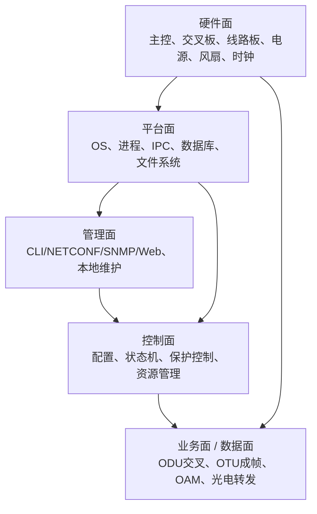
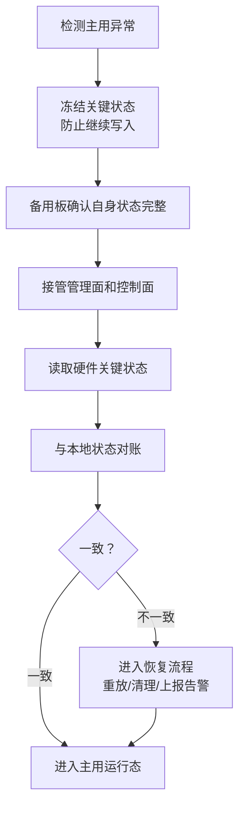

# OTN 嵌入式软件系列 ⑤：高可靠机制——如何让设备失败可控、升级可退、主备可信

通信设备软件和普通软件最大的区别，不是功能复杂，而是**失败代价不同**。

普通软件崩了，可以重启。App 坏了，可以卸载重装。互联网服务异常了，可以灰度回滚、流量切走、用户刷新一下。

OTN 设备不一样。

一台设备跑在现网里，承载的可能是政企专线、金融交易、数据中心互联、骨干传输、云专线、行业专网。它不能因为一个进程崩溃、一块主控板重启、一次版本升级，就让业务断掉。

所以 OTN 嵌入式软件里的高可靠机制，不是一个模块，也不是一个功能点。

它是一套贯穿系统设计的底层原则：

> **设备可以失败，但失败必须被限制在可控范围内；软件可以升级，但升级必须可回退；主备可以切换，但切换后系统必须继续可信。**

这一篇是整个系列里我认为最重要的一篇。

因为前面几篇讲的是：硬件差异怎么抽象，复杂状态怎么可预测，配置怎么一致，告警怎么可解释。

这一篇讲的是：**当这些东西真的出问题时，系统怎么不垮。**

---

## 一、高可靠不是“不出故障”，而是“故障可控”

很多人一听高可靠，第一反应是：提高代码质量，减少 bug。

这当然重要，但不够。

通信设备现场永远会遇到故障：

```text
主控板重启
进程崩溃
板卡拔出
光模块异常
DSP firmware 异常
FPGA 加载失败
交叉板倒换
时钟源丢失
电源模块故障
风扇故障导致温度升高
配置数据库损坏
升级中断电
主备同步中断
```

真正的高可靠系统，不是假设这些事不会发生，而是默认它们一定会发生，然后设计：

```text
故障发生时，影响面多大？
能不能隔离？
业务会不会断？
状态会不会乱？
能不能自动恢复？
恢复后能不能解释？
失败后能不能回退？
```

所以高可靠的第一性原理是：

> **不是消灭所有故障，而是让故障有边界、有退路、有证据。**

---

## 二、OTN 设备里的高可靠对象

OTN 设备不是一个单体软件。它至少有五类高可靠对象。



### 1. 业务面

业务面是最不能乱的地方。

```text
ODU 交叉
OTU 成帧
OPU 映射
OAM 开销
FEC / DSP / 光模块
保护倒换路径
```

OTN 高可靠设计的底线是：

> **控制面异常时，业务面尽量保持最后一个稳定状态继续跑。**

也就是说，主控重启不应该导致交叉表清空；管理进程崩溃不应该导致业务断；配置数据库短暂不可用不应该让硬件转发表被清掉。

### 2. 控制面

控制面负责配置和状态控制。

它可以重启，但重启后必须能恢复：

```text
资源表恢复
状态机恢复
告警状态恢复
保护组状态恢复
配置事务恢复
硬件状态重新对账
```

### 3. 管理面

管理面负责用户访问和网管交互。

管理面挂了，用户暂时不能登录，可以接受；但业务不能断，控制面不能乱。

所以管理面必须和业务面、控制面隔离。

### 4. 平台面

平台面包括操作系统、进程管理、IPC、数据库、文件系统、日志系统、升级系统。

很多高可靠问题，其实不是 OTN 协议问题，而是平台能力问题：

```text
进程反复重启导致 IPC 阻塞
日志写满 flash
数据库写坏
文件系统掉电损坏
watchdog 误复位
进程死锁但 health check 看不出来
```

### 5. 硬件面

主控板、交叉板、时钟板、电源板、风扇板、线路板都有自己的故障模式。

嵌入式软件必须知道哪些硬件故障会影响业务，哪些只影响管理，哪些必须触发保护或主备倒换。

---

## 三、控制面和数据面必须隔离

这是 OTN 高可靠最重要的设计原则之一。

> **控制面可以失败，数据面不能轻易跟着失败。**

### 错误设计

```text
主控软件重启
    ↓
所有硬件配置重新初始化
    ↓
交叉表被清空
    ↓
业务中断
```

这种系统等于把业务面绑死在控制面生命周期上。

### 正确设计

```text
主控软件重启
    ↓
硬件保持最后稳定配置
    ↓
业务继续转发
    ↓
主控恢复后重新读取硬件状态
    ↓
数据库、内存状态、硬件状态三方对账
```

这就叫业务面 holdover。

在 OTN 设备里，典型 holdover 对象包括：

```text
交叉芯片表项
ODU 容器配置
OTU 成帧配置
OAM 开销配置
保护工作/保护通道选择
光模块基本工作状态
时钟保持状态
```

当然，不是所有东西都能 holdover。

比如控制面重启期间，可能无法处理新配置、无法响应部分管理请求、无法上报实时告警。但底线是：**已经承载的业务不能因为控制面重启而被主动破坏。**

---

## 四、主备机制：不是两块板，而是一套状态可信机制

很多人把主备理解成：一块主控板工作，一块备用主控板待命。

这只是硬件形态。

真正的主备机制，核心是：

> **备用主控接管时，能不能相信自己掌握的状态？**

### 主备至少有四种层次

```text
冷备：备用板不运行或只运行最小系统，切换慢
温备：备用板运行系统，但状态同步有限
热备：备用板持续同步关键状态，可快速接管
双活：两边都处理业务，需要更复杂一致性机制
```

OTN 设备通常追求热备，但不一定所有状态都热同步。

因为同步太少，接管不了；同步太多，又会把临时错误同步过去。

### 哪些状态必须同步？

```text
已提交配置
资源占用状态
保护组配置
保护组当前选择状态
业务激活状态
告警当前状态
性能统计基线
配置事务日志
软件版本与配置 schema 版本
板卡在位和能力信息
```

### 哪些状态不应该同步？

```text
线程栈上的临时变量
未确认的中间事件
临时定时器剩余毫秒数
硬件访问过程中的临时状态
本板局部 IPC 队列
尚未完成校验的半配置
```

原则是：

> **同步可以帮助备用板接管的稳定状态，不同步只属于当前执行过程的瞬态状态。**

### 主备同步必须有顺序和版本

状态同步不能只是“发一堆消息过去”。

必须有：

```text
sequence number：保证顺序
epoch / generation：区分不同主用周期
transaction id：关联配置事务
schema version：识别状态结构版本
checkpoint：全量基线
delta：增量变化
ack：确认备用板已接收
```

否则主备倒换后会出现典型问题：

```text
备用板收到配置删除，但没收到配置创建
备用板收到保护状态变化，但没收到告警根因
备用板收到资源释放，但没收到资源占用
```

这类问题最难查，因为主用板看起来一切正常，只有倒换之后才暴露。

---

## 五、主备倒换的正确流程

主备倒换不是“备用板变主用”这么简单。

一个可靠的倒换流程至少包括：



### 倒换前：判断主用是否真的死了

主用异常可能有很多种：

```text
主控板掉电
主进程 crash
控制面死锁
管理面无响应
IPC 阻塞
CPU 打满
心跳丢失
```

不能只靠一个心跳判断。

否则会出现 split-brain：两块主控都认为自己是主用。

### 倒换中：防止双主

双主是主备系统最危险的状态。

两个主控同时下硬件配置，后果不可预测。

常见防护：

```text
硬件仲裁信号
背板主用锁
主备心跳 + 仲裁
管理口虚 IP 漂移控制
写硬件权限只允许主用拥有
备用板所有配置写操作默认禁止
```

### 倒换后：必须做 reconciliation

备用板成为主用后，不能盲目相信自己同步来的状态。

它要做轻量对账：

```text
配置数据库是否完整？
硬件关键表项是否存在？
交叉状态是否与业务配置一致？
保护组当前工作通道是否一致？
告警状态是否需要重新扫描？
板卡在位状态是否最新？
```

倒换后最重要的不是“马上继续干活”，而是先确认：

> **我现在接管的世界，是不是我以为的那个世界。**

---

## 六、进程级高可靠：不是所有崩溃都该整机复位

OTN 设备软件通常由多个进程或任务组成：

```text
配置管理进程
告警进程
性能采集进程
保护控制进程
板卡管理进程
数据库进程
北向管理进程
CLI 进程
日志进程
升级进程
```

一个进程异常，不应该天然导致整机复位。

### 进程健康检查

健康检查不能只看“进程还在不在”。

进程活着，不代表它健康。

更好的健康检查包括：

```text
进程是否存活
主循环是否运行
关键线程是否响应
消息队列是否堆积
IPC 请求是否超时
内存是否持续增长
CPU 是否异常占用
关键状态机是否卡住
```

### 重启策略要分级

```text
L1：重启单个线程 / task
L2：重启单个进程
L3：重启相关进程组
L4：触发主备倒换
L5：整板复位
L6：整机保护性复位
```

高可靠系统的目标是：**能小范围恢复，就不要大范围复位。**

### 故障升级要有节流

如果一个进程反复 crash，不能无限重启。

```text
1 分钟内 crash 3 次 → 停止自动重启，触发进程组恢复
5 分钟内进程组恢复失败 → 触发主备倒换
主备倒换后仍失败 → 上报严重告警，进入降级模式
```

否则 watchdog 会变成“自杀循环”。

---

## 七、故障隔离：让错误停在边界内

高可靠的关键是隔离。

没有隔离，小 bug 会变成系统级事故。

### 1. 模块隔离

管理面崩溃，不应该影响控制面。

日志系统写满，不应该阻塞保护倒换。

性能采集异常，不应该拖死告警处理。

### 2. 资源隔离

```text
保护倒换线程有独立高优先级资源
告警事件队列有上限和丢弃策略
日志队列不能无限增长
北向请求不能占满全部 worker
低优先级巡检不能抢占实时路径
```

### 3. 数据隔离

配置数据库、运行状态数据库、性能历史数据库、日志文件，不应该混在一个文件或一个写路径里。

否则一个日志写满 flash，可能连配置都写不进去。

### 4. 故障域隔离

一块线路板故障，不应该导致整机控制面异常。

一个端口告警风暴，不应该拖垮整机告警系统。

一个业务配置失败，不应该污染其他业务资源。

> **高可靠系统的核心能力，是让错误停在它该停的地方。**

---

## 八、升级可靠性：ISSU、A/B 分区和回退

通信设备升级，是高可靠机制里最难的场景之一。

因为升级同时改变：

```text
可执行文件
数据库 schema
配置解释逻辑
硬件驱动
FPGA / DSP firmware
协议行为
主备兼容关系
```

### A/B 分区

常见做法是双镜像：

```text
A 分区：当前运行版本
B 分区：新版本
```

升级流程：

```text
下载新版本到 B
校验签名和完整性
设置下一次启动分区为 B
重启进入 B
启动健康检查
健康通过 → commit B
健康失败 → 回退 A
```

关键点：**新版本启动成功不等于升级成功。**

必须满足：

```text
关键进程正常
配置加载成功
硬件初始化成功
业务状态恢复正常
告警系统正常
主备同步正常
管理面可登录
```

这些都通过后，才能 commit。

### ISSU

ISSU（In-Service Software Upgrade）更难。

它的目标是不中断业务升级。

但必须分清楚：

```text
业务不中断 ≠ 所有控制能力不中断
业务不中断 ≠ 没有任何告警
业务不中断 ≠ 所有模块都支持热升级
```

OTN 设备做 ISSU 时，底线是：

> **数据面保持，控制面分阶段重启，主备轮换升级，状态版本兼容。**

一个典型 ISSU 流程：

```text
1. 备用主控先升级
2. 新备用主控启动，与旧主用建立兼容同步
3. 主备倒换，新版本成为主用
4. 原主用变备用，再升级
5. 两边版本一致后 commit
```

难点在于：新旧版本在一段时间内必须共存。

这要求：

```text
主备同步协议版本兼容
配置 schema 向前/向后兼容
状态字段新增不能破坏旧版本
新版本不能立即写入旧版本无法识别的配置
```

### 回退

升级失败必须能回退。

但回退不是简单切回旧分区。

如果新版本已经修改了配置数据库 schema，旧版本还能不能读？

如果新版本已经升级了 FPGA，比特流能不能回退？

如果新版本已经创建了旧版本不支持的业务，怎么办？

所以可靠升级必须设计：

```text
配置 schema migration
配置 schema downgrade
新功能开关
升级事务日志
硬件 firmware 版本兼容矩阵
回退前检查
回退后恢复流程
```

---

## 九、数据一致性：什么是“可信状态”？

高可靠系统最怕状态不可信。

比如主备倒换后：

```text
数据库说业务存在
硬件里交叉表项不存在
备用板内存资源表说资源已占用
告警状态说业务正常
网管显示业务激活
```

这时系统不是简单“有 bug”，而是状态失去可信性。

### 可信状态的来源

可信状态不是单点来源。

```text
配置数据库：用户期望
运行内存：当前控制面理解
硬件表项：真实转发状态
告警状态：当前故障状态
事务日志：未完成变化
主备同步日志：状态传播历史
```

高可靠机制要做的是对账：

```text
配置数据库 vs 硬件
运行状态 vs 硬件
主用状态 vs 备用状态
事务日志 vs 当前配置
告警状态 vs 硬件缺陷
```

### Reconciliation 是高可靠系统的基本能力

reconciliation 不是异常修复脚本，而是设备启动、主备切换、升级恢复后的标准动作。

它回答：

```text
系统当前真实状态是什么？
哪些状态一致？
哪些状态冲突？
冲突按什么规则解决？
解决过程是否可记录、可回退？
```

---

## 十、降级模式：不是所有故障都要停止服务

高可靠设备应该支持降级运行。

例如：

```text
管理面故障 → 业务继续，禁止新配置
性能采集异常 → 业务继续，上报采集故障
单块风扇故障 → 业务继续，提高其他风扇转速
备用主控故障 → 主用继续运行，上报冗余丢失
保护通道故障 → 工作通道继续，保护能力降级
数据库只读 → 保持已有业务，禁止配置变更
```

降级模式的核心是：

> **在不能完全正常时，系统仍然以受限制、可解释的方式继续服务。**

降级运行必须满足三个条件：

```text
1. 明确限制：哪些能力不可用
2. 明确告警：告诉运维当前冗余或能力下降
3. 明确恢复路径：故障恢复后如何回到正常模式
```

---

## 十一、看门狗不是万能药

嵌入式系统喜欢用 watchdog。

但 watchdog 只能解决一类问题：系统卡死后复位。

它解决不了：

```text
状态错误但进程还活着
逻辑死循环但定时喂狗正常
业务配置错了
告警状态不一致
主备同步错序
数据库损坏
内存泄漏尚未触发崩溃
```

更危险的是，watchdog 用不好会制造事故：

```text
CPU 忙于告警风暴 → 来不及喂狗 → 整板复位 → 业务中断
日志 flash 写慢 → 进程阻塞 → watchdog 复位 → 问题放大
```

所以 watchdog 需要分层：

```text
硬件 watchdog：防止系统完全死掉
软件 watchdog：监控关键进程
业务 watchdog：监控关键状态机是否推进
保护 watchdog：监控保护倒换是否完成
```

并且每一层都要定义：

```text
触发后做什么？
是重启进程，还是倒主备，还是整板复位？
触发频率过高怎么办？
触发前能不能保存现场？
```

---

## 十二、高可靠测试：必须主动制造失败

高可靠机制不能靠正常测试证明。

必须主动制造失败。

### 1. 主备倒换测试

```text
手工主备倒换
主用断电
主用进程 crash
主用 CPU 打满
主备心跳中断
倒换过程中下发配置
倒换过程中出现告警风暴
倒换过程中保护倒换
```

检查：

```text
业务是否中断
倒换时间是否满足要求
配置是否一致
告警是否重复或丢失
备用是否正确接管
是否出现双主
```

### 2. 进程级故障注入

```text
kill 配置进程
kill 告警进程
kill 数据库进程
kill 日志进程
制造 IPC 阻塞
制造消息队列堆积
制造内存泄漏
```

检查恢复策略是否分级，是否误触发整机复位。

### 3. 升级与回退测试

```text
升级中断电
升级包损坏
新版本启动失败
新版本配置加载失败
主备一新一旧
schema migration 失败
rollback 后配置是否可读
```

升级测试重点不是“成功升级”，而是“失败后能不能回退”。

### 4. 资源耗尽测试

```text
flash 写满
日志爆量
告警风暴
CPU 打满
内存耗尽
文件句柄耗尽
IPC 队列满
```

高可靠系统必须知道资源耗尽时怎么降级，而不是直接崩。

### 5. 长时间 soak + 随机故障

```text
72 小时随机拔插板卡
随机 kill 进程
随机触发保护倒换
随机下发配置
随机制造 LOS/LOF/误码
随机主备倒换
```

目的不是验证单个功能，而是验证系统在长期扰动下是否保持一致。

---

## 十三、几个常见错误

### 错误一：把主备当成高可靠全部

主备只是高可靠的一部分。

如果状态同步错了，主备切换只是把错误从主用搬到备用。

### 错误二：所有异常都整板复位

这看起来简单，但影响面太大。

高可靠系统应该优先局部恢复。

### 错误三：升级只测成功路径

真实现场最怕升级失败。

升级机制的质量，取决于失败后能不能回退。

### 错误四：同步所有状态

同步太少接不住，同步太多会把瞬态错误同步过去。

关键是识别“稳定状态”和“瞬态状态”。

### 错误五：缺少状态对账

主备倒换、重启、升级后，如果不做 reconciliation，系统只能相信自己“应该是对的”。

这在通信设备里不够。

---

## 总结

OTN 嵌入式软件的高可靠机制，不是一个功能，而是一整套系统设计。

它覆盖：

```text
控制面 / 数据面隔离
主备同步与倒换
进程级故障恢复
故障域隔离
ISSU / A-B 分区 / 回退
状态对账
降级运行
watchdog 分层
故障注入测试
```

这一篇的核心要点：

```text
1. 高可靠不是不出故障，而是故障可控
2. 数据面必须尽量和控制面生命周期解耦
3. 主备机制的核心不是两块板，而是备用板接管时状态是否可信
4. 主备同步要区分稳定状态和瞬态状态
5. 倒换后必须做状态对账
6. 进程崩溃不应该天然触发整机复位，恢复要分级
7. 故障隔离决定小 bug 会不会变成系统级事故
8. 升级可靠性重点是失败可回退，而不是只证明升级成功
9. 降级模式是高可靠系统的重要能力
10. 高可靠测试必须主动制造失败
```

> **好的高可靠系统，不是永远不失败，而是失败之后仍然有边界、有证据、有退路。**

---

*这是 OTN 嵌入式软件系列的第五篇。下一篇：实时性与确定性。*

*用到的思维框架：高可靠、故障隔离、主备同步、ISSU、状态对账、降级运行、故障注入。*
