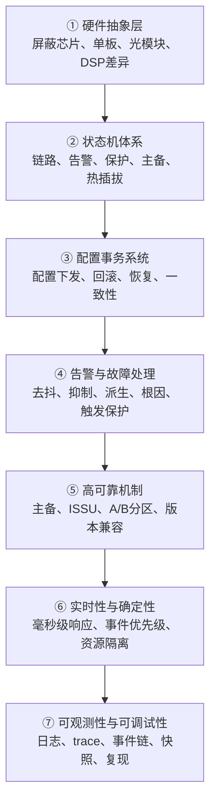

# OTN 嵌入式软件系列：把复杂设备组织成确定性系统

这组文章只讨论**跑在 OTN 设备上的嵌入式软件**。

不讨论 EMS/NMS，不讨论上层控制器，不讨论 SDN 编排，也不讨论云网协同平台。

讨论范围是：

```text
机框 / 单板 / 子卡 / 光模块 / DSP / 交叉芯片 / FPGA / MCU / CPU
上面的 Boot、BSP、驱动、HAL、配置、OAM、告警、保护倒换、状态机、升级、主备、HA
```

核心问题是：

> **OTN 嵌入式软件如何把复杂硬件、复杂协议、复杂光电状态，组织成一个稳定、可解释、可恢复、可长期演进的确定性系统？**

这不是“功能开发”问题，而是“系统组织”问题。

---

## 总框架

OTN 嵌入式软件可以分成七个层面：



这七层不是简单并列关系。它们共同回答一个问题：

> **设备出了异常之后，系统能不能保持确定、可解释、可恢复？**

---

## 已发布

- **[① 硬件抽象层：把硬件差异压到边界里](otn-embedded-01-hal)**
- **[② 状态机体系：如何让复杂状态仍然可预测](otn-embedded-02-state-machine)**
- **[③ 配置事务系统：如何保证配置一致、可回滚、可恢复](otn-embedded-03-config-transaction)**
- **[④ 告警与故障处理：从事件上报到故障传播理解](otn-embedded-04-alarm-fault)**

## 系列目录

### 1. 硬件抽象层：把差异压到边界里

OTN 设备里没有“统一硬件”。

不同单板、不同子卡、不同芯片、不同光模块、不同 DSP、不同 FPGA 版本，都会带来差异。

硬件抽象层的目标不是“封装几个驱动接口”，而是：

> **把硬件差异压缩到系统边界内，不让差异无限向上泄漏。**

要讨论的问题：

- 芯片能力如何建模？
- 端口、ODU、OTU、交叉、光模块怎么抽象？
- 能力差异怎么表达？
- HAL 是不是越统一越好？
- 如何避免“上层逻辑被硬件细节污染”？

---

### 2. 状态机体系：设备软件真正的骨架

OTN 嵌入式软件里最复杂的东西，经常不是算法，而是状态。

```text
LOS / LOF / OOF / AIS / BDI / TIM / DEG
保护倒换 / WTR / 锁定 / 强制倒换 / 人工倒换
板卡在位 / 拔出 / 上电 / 初始化 / 失败 / 恢复
主备同步 / 主备切换 / 配置恢复
```

单个状态机不难，难的是多个状态机叠加之后仍然可预测。

要讨论的问题：

- 状态机如何拆分边界？
- 状态之间如何避免互相污染？
- 如何处理瞬态、抖动、竞态？
- 保护倒换和告警状态如何协同？
- 状态机怎么测试？

---

### 3. 配置事务系统：一条业务不是一次写寄存器

OTN 设备上的一条业务配置，往往涉及多个对象：

```text
客户侧端口
ODU / OPU 映射
交叉连接
OTU 线路侧
OAM 开销
告警抑制
性能统计
保护关系
硬件寄存器
配置数据库
```

任何一步失败，都可能留下半配置状态。

配置事务系统要解决的是：

> **配置如何原子化？失败如何回滚？重启如何恢复？主备如何保持一致？**

要讨论的问题：

- 配置路径如何分层？
- 先写数据库还是先写硬件？
- 部分失败如何处理？
- 配置恢复如何保证顺序？
- 主备倒换时如何避免状态不一致？

---

### 4. 告警与故障处理：从报事件到理解故障传播

OTN 告警不是简单“检测到就上报”。

一条光纤断了，可能引发：

```text
LOS → LOF → OTU-AIS → ODU-AIS → 客户侧业务告警 → 保护倒换
```

如果不做处理，网管看到的是告警风暴。

设备嵌入式软件要做的是：

> **去抖、抑制、相关、分层、触发保护，并尽量保留故障传播链。**

要讨论的问题：

- 告警去抖怎么设计？
- 根因告警和派生告警如何区分？
- 告警抑制会不会掩盖真实问题？
- 告警与保护倒换如何联动？
- 性能劣化和硬故障如何区分？

---

### 5. 高可靠机制：设备不能像 App 一样重装

通信设备软件最特别的地方是：它不能轻易失败。

```text
业务不能断
配置不能丢
升级不能挂
主备不能乱
回退必须可靠
老版本配置必须兼容
```

高可靠机制包括：

- 主备倒换
- 配置同步
- 状态同步
- ISSU
- A/B 分区
- 版本回退
- 配置迁移
- 看门狗
- 进程保活

要讨论的问题：

- 哪些状态必须同步，哪些不能同步？
- 主备倒换时如何保证业务不中断？
- ISSU 的边界在哪里？
- 配置版本如何兼容？
- 软件失败如何限制影响面？

---

### 6. 实时性与确定性：通信设备软件不能只追求“智能”

OTN 设备里，有些事件必须在确定时间内处理：

```text
保护倒换
光模块异常
DSP / FEC 事件
板卡热插拔
时钟切换
电源/风扇/温度异常
```

这里的核心不是“越智能越好”，而是：

> **在复杂负载下，关键事件仍然按确定时序被处理。**

要讨论的问题：

- 哪些逻辑必须实时？哪些可以异步？
- 事件优先级怎么设计？
- 控制面和管理面如何隔离？
- CPU 忙时如何保证保护倒换？
- 日志、告警、性能采集会不会反过来影响实时路径？

---

### 7. 可观测性与可调试性：现场问题能不能复现，决定系统能不能进化

OTN 设备的问题经常发生在现场：

```text
某个版本
某块单板
某种光模块
某条链路
某次倒换
某个抖动窗口
某个竞态条件
```

实验室复现不了，日志又不够，问题就会变成玄学。

可观测性要解决的是：

> **设备在现场出问题时，软件能不能留下足够证据，让工程师还原事件链？**

要讨论的问题：

- 日志分级怎么设计？
- trace 如何避免影响实时性？
- 状态快照保存哪些信息？
- 事件链如何串起来？
- crash dump、core、黑匣子怎么做？
- 如何让现场问题进入测试体系？

---

## 总结

OTN 嵌入式软件的创新，不是“多做几个功能”。

它更像是在建一个确定性系统：

```text
复杂硬件
复杂协议
复杂光电状态
复杂异常组合
    ↓
嵌入式软件组织
    ↓
稳定、可解释、可恢复、可演进的设备
```

七个系列分别对应这个系统的七块骨架：

| 序号 | 系列 | 核心问题 |
|---|---|---|
| 1 | 硬件抽象层 | 如何把硬件差异压到边界里 |
| 2 | 状态机体系 | 如何让复杂状态仍然可预测 |
| 3 | 配置事务系统 | 如何保证配置一致、可回滚、可恢复 |
| 4 | 告警与故障处理 | 如何从事件上报走向故障传播理解 |
| 5 | 高可靠机制 | 如何让设备失败可控、升级可退、主备可信 |
| 6 | 实时性与确定性 | 如何保证关键事件按确定时序处理 |
| 7 | 可观测性与可调试性 | 如何让现场问题可还原、可复现、可修正 |

后面的文章，会按这七个方向逐篇展开。

---

*这是 OTN 嵌入式软件系列的总纲。*
