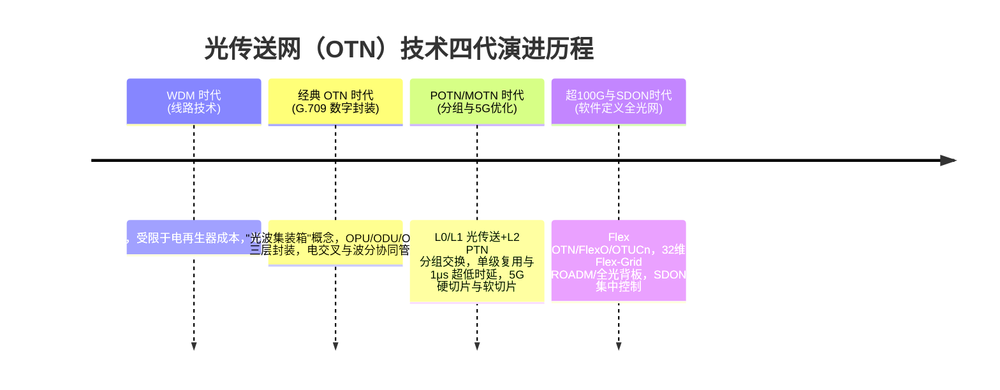
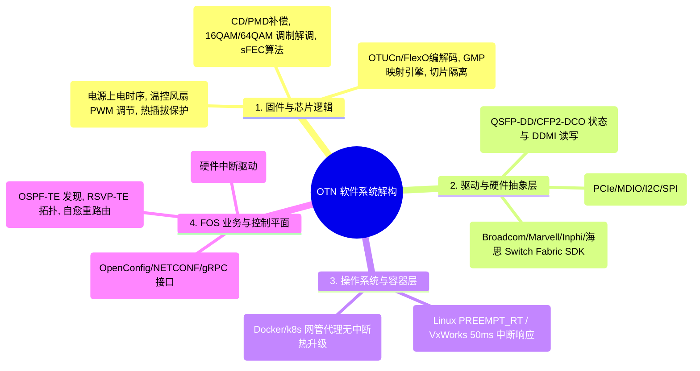
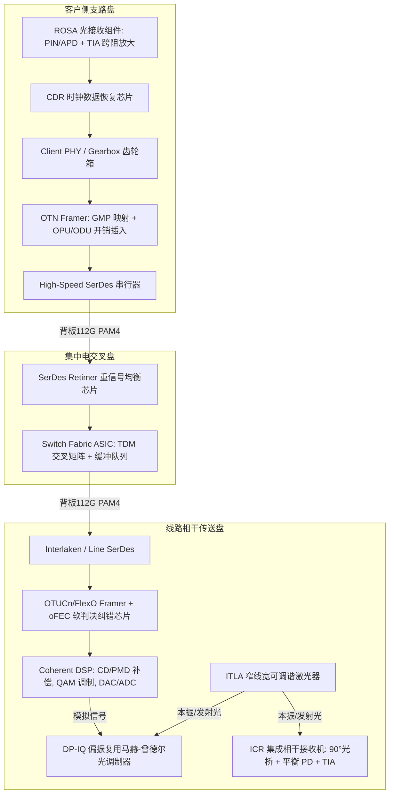
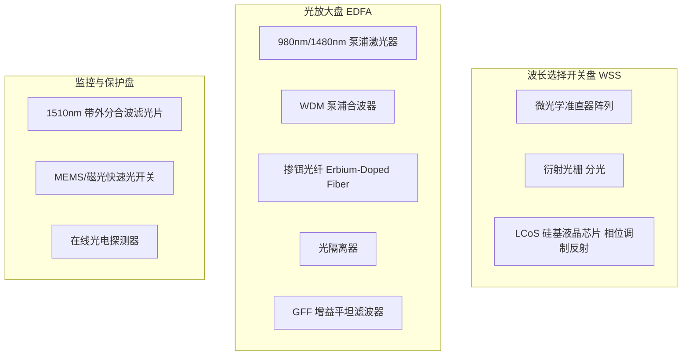
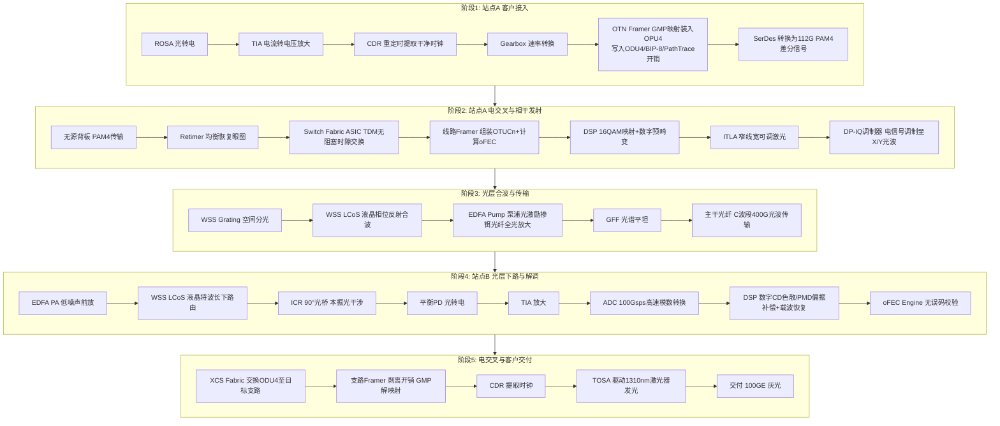

> 从芯片级器件拆解到跨省 1000 公里业务全流程——一份 OTN 设备架构与信号旅程的完整蓝图。

本文覆盖五个维度：**技术演进 → 软件栈 → 硬件芯片级拆解 → 端到端业务流水线 → 厂商架构与未来演进**。

---

## 第一章：OTN 技术演进——从线路技术到智能全光网

光传送网（OTN）是现代电信运营商与数据中心基础设施的"数字底座"。其核心演进历程体现了从 **"点到点大容量管道"向"智能化、分组化、软件定义全光骨干"** 的本质跨越：

> **核心本质**：传统 WDM 仅仅是"点到点高速公路"，解决的是容量问题；而 OTN 通过引入开销（Overhead）与交叉（Cross-connect），赋予了光波长精确管理、监控、路由与保护的能力，成为了光网络领域的**智能交通管理系统**。

---

## 第二章：OTN 设备全栈软件体系解构

现代 OTN 软件栈已从封闭的单体架构演进为**解耦化、微服务化与可编程的 SDON 软件体系**：

### 软件各层核心功能表

| 软件层级 | 模块名称 | 核心职责与关键技术 |
| :--- | :--- | :--- |
| **应用层** | **FOS 软件 (Feature OS)** | 运行于主控板，负责业务开通配置、ASON 自动路由与故障自愈、50ms APS 保护倒换及 NETCONF/YANG 北向网管接入 |
| **操作系统** | **实时 OS & 容器** | 采用 PREEMPT_RT 补丁的嵌入式 Linux，保障 APS 保护倒换等高实时任务在微秒级内抢占响应；Docker 实现组件热升级 |
| **驱动层** | **驱动 & 芯片 HAL** | 封装底层芯片差异，遵照 CMIS 规范控制光模块，调用 Broadcom/海思 SDK 初始化电交叉矩阵 |
| **固件层** | **DSP 固件 & FPGA 逻辑** | 运行于芯片内部的底层微码。相干 DSP 固件负责色散补偿与 QAM 调制；FPGA 逻辑实现 OTUCn/FlexO 组帧与切片隔离 |

---

## 第三章：OTN 设备硬件系统与内部器件芯片级拆解

### 3.1 机框与背板子系统

- **高频无源电背板 (High-Speed Backplane)**：采用 20~30 层 Megtron 7/Taconic 高频电路板材，支持单通道 **56G/112G PAM4** 信号无损传输，支持单槽位 1.6T~3.2T 演进。
- **全光背板 (Optical Backplane / Flex-Harness)**：在全光交叉 (OXC) 设备中，将数百根光纤网格化封装于机框内部，实现全光 ROADM **免跳线盲插**，解决"光纤雪崩"难题。

### 3.2 电层单盘内部器件芯片级拆解

| 单盘名称 | 核心器件 | 器件类型 | 核心功能与动作说明 |
| :--- | :--- | :--- | :--- |
| **支路盘 (Client)** | **ROSA / TOSA** | 光电子组件 | ROSA：PIN/APD 光敏二极管将光转电流，TIA（跨阻放大器）转为电压。TOSA：激光驱动器驱动 DML/EML 激光器发光 |
| | **CDR** | 混信号芯片 | 时钟数据恢复 (Clock Data Recovery)，从抖动信号中提取干净时钟脉冲，消除 Jitter |
| | **Gearbox** | 逻辑 PHY | 接口速率转换芯片，如将 4×25G NRZ 转换复复用为 2×50G PAM4 差分信号 |
| | **OTN Framer** | 数字 ASIC/FPGA | GMP 通用映射引擎计算填充 Stuffing 比特；开销插入器写入 OPU/ODU 帧头、Path Trace、BIP-8 校验及 TCM 开销 |
| | **SerDes** | 接口芯片 | 串行/解串器，将内部并行总线转为 56G/112G PAM4 高速差分信号驱动无源背板 |
| **交叉盘 (XCS)** | **SerDes Retimer** | 信号 Conditioning | 针对高频背板衰减进行 CTLE/DFE 接收端均衡与 TX 预加重 (Pre-emphasis)，恢复信号眼图 |
| | **Switch Fabric ASIC** | 集中交换 ASIC | TDM 交叉矩阵，微秒级无阻塞完成 ODU0/ODUflex/ODU4 级别全局时隙交换与多播 |
| **线路盘 (Line)** | **oFEC & Framer** | 逻辑 ASIC | 组装 OTUCn/FlexO 超 100G 帧，计算并插入 oFEC 软判决前向纠错码（提供 11dB~15dB 净编码增益 NCG） |
| | **Coherent DSP** | 高算力 DSP | Tx侧：QPSK/16QAM/64QAM 符号映射、数字色散预补偿、高速 DAC。Rx侧：高速 ADC、数字 CD 补偿、PMD 自适应偏振解复用、载波相位恢复 |
| | **ITLA** | 窄线宽激光器 | 可调谐激光器，产生线宽 < 100kHz 的超窄线宽连续光（C/L 波段内自由调谐），作为发射载波或接收本振光 (LO) |
| | **DP-IQ Modulator** | 硅光/LN 光调制器 | 双偏振 IQ 调制器，包含两个 Mach-Zehnder 光干涉仪，将 DSP 输出的模拟电信号调制到 X/Y 两个偏振态的光波上 |
| | **ICR** | 混频光接收机 | 集成相干接收机，包含 90° 光杂化光桥、两对平衡光电探测器 (Balanced PD) 和 TIA，解调出 IX, QX, IY, QY 四路基带信号 |

### 3.3 光层单盘内部器件芯片级拆解（ROADM & 光子系统）

| 单盘名称 | 核心器件 | 器件类型 | 核心功能与动作说明 |
| :--- | :--- | :--- | :--- |
| **波分盘 (WSS)** | **Grating (衍射光栅)** | 微光学透镜 | 空间色散器件，将输入的 C/L 波段多波长复用光按波长角度展开成平行光谱带 |
| | **LCoS Engine** | 硅基液晶微阵列 | **WSS 的心脏**。通过控制数百微米像素点的电压改变液晶分子相位，控制特定波长光的反射角度，实现 Flex-Grid 任意波长向指定输出端口路由 |
| **光放大盘 (OA)** | **Pump Laser** | 高功率激光器 | 产生 980nm（低噪声前放 PA）或 1480nm（高功率增放 BA）的强激励光 |
| | **掺铒光纤 (EDF)** | 特种光纤 | 掺杂稀土元素铒 (Er3+)，在泵浦光作用下产生粒子数反转，通过受激辐射对 1550nm 业务光进行纯光域功率放大 |
| | **Isolator (隔离器)** | 磁光器件 | 仅允许光单向通过，阻断反射光，防止自激振荡损坏泵浦激光器 |
| | **GFF (平坦滤波器)** | 光学滤光片 | 修正 EDFA 在 C 波段不同波长增益不均的缺陷，确保所有波长输出功率平坦 |
| **保护盘 (OLP)** | **MEMS 光开关** | 微机电光器件 | 响应微秒级中断信号，在 **<10ms** 内物理切换主备光纤光路 |
| | **Splitter (分光器)** | 无源分光 | 1:2 光耦合器，将发射端光信号一分为二，同时发往主/备两条线路光纤 |

---

## 第四章：端到端业务物理与逻辑链路全流程解构

### 4.1 100GE 业务跨长途传输全流程

以一条 **100GE 客户业务** 从 **站点 A（北京）** 跨越 1000 公里传输至 **站点 B（上海）** 为例：

```mermaid
sequenceDiagram
    autonumber
    participant ClientA as 客户设备 A
    participant TribA as 站点A: 支路盘
    participant BP_A as 站点A: 高速背板
    participant XCSA as 站点A: 电交叉盘
    participant LineA as 站点A: 线路相干盘
    participant WSSA as 站点A: ROADM
    participant OAA as 站点A: 光放大盘
    participant LineFiber as 传输光纤
    participant OAB as 站点B: 光放大盘
    participant WSSB as 站点B: ROADM
    participant LineB as 站点B: 线路相干盘
    participant XCSB as 站点B: 电交叉盘
    participant TribB as 站点B: 支路盘
    participant ClientB as 客户设备 B

    rect rgb(20, 35, 60)
    note over ClientA, LineA: 站点 A 发送端电/光处理流程
    ClientA->>TribA: 1. 发送 100GE 灰光信号 (1310nm)
    note over TribA: ROSA探测光→TIA转电压→CDR提取干净时钟→Framer GMP映射入OPU4，写入ODU4/PathTrace开销
    TribA->>BP_A: 2. SerDes 转换为 112G PAM4 差分信号
    BP_A->>XCSA: 3. 背板传输至集中电交叉盘
    note over XCSA: Retimer恢复信号眼图→Switch Fabric ASIC TDM时隙无阻塞交叉调度至指定线路槽位
    XCSA->>LineA: 4. 送入 400G 相干线路盘
    note over LineA: FlexO/OTUCn组帧+插入oFEC→DSP QPSK/16QAM调制+数字色散预补偿→ITLA产生193.1THz窄线宽激光→DP-IQ调制器调制为400G双偏振相干光波
    end

    rect rgb(40, 30, 60)
    note over WSSA, OAB: 光层路由、复用与长途传输流程
    LineA->>WSSA: 5. 输出 400G C波段单波长光信号
    note over WSSA: 衍射光栅分光→LCoS液晶相位控制反射并多波长合路(Mux)
    WSSA->>OAA: 6. 送入光放大盘 EDFA
    note over OAA: 980nm Pump激励掺铒光纤全光放大→GFF平坦化光谱
    OAA->>LineFiber: 7. 注入主干光纤传输 (带外1510nm OSC随纤监控)
    LineFiber->>OAB: 8. 经历 1000km 衰减后到达站点 B
    note over OAB: OSC滤光片剥离1510nm网管信号→泵浦+EDF前置低噪声光放大(PA)
    end

    rect rgb(20, 35, 60)
    note over WSSB, ClientB: 站点 B 接收端解调与客户交付流程
    OAB->>WSSB: 9. 放大后的多波长光信号
    note over WSSB: 衍射光栅分光→LCoS液晶相位调整将特定400G波长下路由(Demux)至指定线路盘
    WSSB->>LineB: 10. 送入相干线路盘
    note over LineB: ITLA本振光+90°光桥相干混合→Balanced PD/TIA解调为4路基带信号→ADC模数转换→DSP数字CD/PMD补偿→oFEC引擎纠错→Framer剥离开销解出ODU4
    LineB->>XCSB: 11. ODU4 时隙送入集中电交叉盘
    note over XCSB: Switch Fabric ASIC 将 ODU4 交换至目标支路槽位
    XCSB->>TribB: 12. 送入客户侧支路盘
    note over TribB: Framer剥离OPU4开销，GMP解映射还原100GE→TOSA激光驱动器驱动发光
    TribB->>ClientB: 13. 还原为原始 100GE 灰光信号交付给客户设备 B
    end
```

### 4.2 信号旅程：器件行为 Step-by-Step

---

## 第五章：业界主流厂商架构与未来演进

### 5.1 主流厂商商用设备架构映射

在电信工程落地中，业界五大主流厂商的产品线均严格遵循上述软硬件解构规范：

| 厂商 | 旗舰产品线 | 核心电交叉容量 | 光层 ROADM 架构 | 软件与控制平面 |
| :--- | :--- | :--- | :--- | :--- |
| **华为 (Huawei)** | **OptiX OSN 9800 / OXC** | 64T / 槽位 1.6T~3.2T | 32维 CDC-F ROADM / 全光柔性背板 (OXC) | NCE 管控系统, ASON 2.0 智能网 |
| **中兴 (ZTE)** | **ZXONE 9700 系列** | 64T 集中电交叉 | 20维/32维 Flex-Grid ROADM | Athena 光网络管控平台, WASON |
| **烽火 (FiberHome)** | **FONST 6000 U系列** | POTN 统一信元交换 | 灵活栅格 ROADM | FitOM 平台, 软件定义 SDON Agent |
| **Ciena** | **Wavesmith / 6500** | LiquidSpectrum 架构 | Coherent Select ROADM | MCP (Domain Controller), Liquid Spectrum |
| **Nokia** | **1830 PSS 系列** | PSE-6s 800G/1.2T 芯片 | CDC-F WSS ROADM | NSP (Network Services Platform) |

### 5.2 全光网 (AON) 与算力网络演进展望

1. **单波速率升级**：从 400G QPSK/16QAM 向 **800G/1.2T/1.6T** 演进，采用更高 Baud Rate (120GBaud+) 与 3nm/2nm DSP。
2. **频谱拓展 (C+L 12THz)**：波长传输范围从传统 C 波段 (80波/48波) 全面扩展至 **C+L 一体化波段 (120波~192波)**，单纤容量突破 100Tbps。
3. **光电融合与全光交叉 (OXC)**：通过**全光背板 (Optical Backplane)** 彻底解决机房内成千上万根光纤跳线的"光纤雪崩"难题，降低机房功耗 40% 以上。
4. **算力网协同 (Compute-Network Integration)**：OTN 作为算力网络（东数西算）的底层高速动脉，通过 **1ms 微秒级时延圈与敏捷切片**，实现数据中心 (DCI) 间的高效无损互连。

---

> **终极总结**：光传送网 (OTN) 的本质，是一个在软件定义控制平面 (SDON) 统一指挥下，由**底层的数字芯片 (Framer/Fabric/DSP)**、**高频电接口 (112G PAM4)** 与 **精密微光子器件 (WSS LCoS/EDFA Pump/ITLA)** 深度协同，将任意格式的客户信号转换为高可靠、长距离、超大带宽相干光波传输的**智能光电巨型基础设施**。
