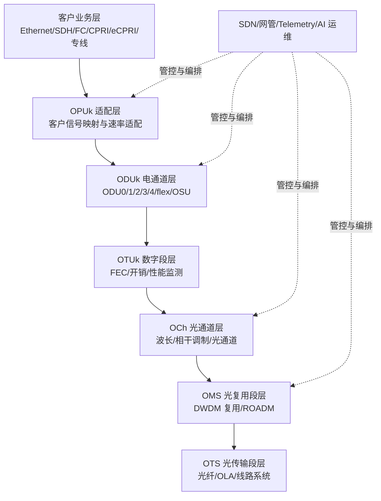
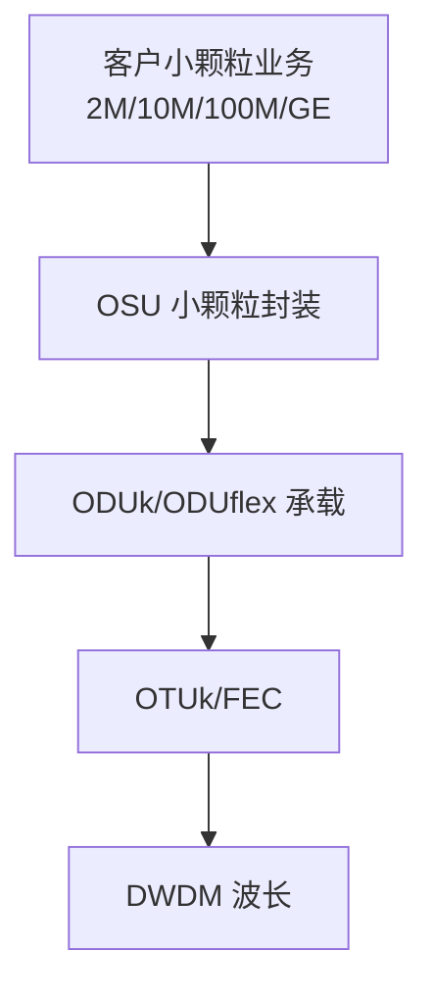
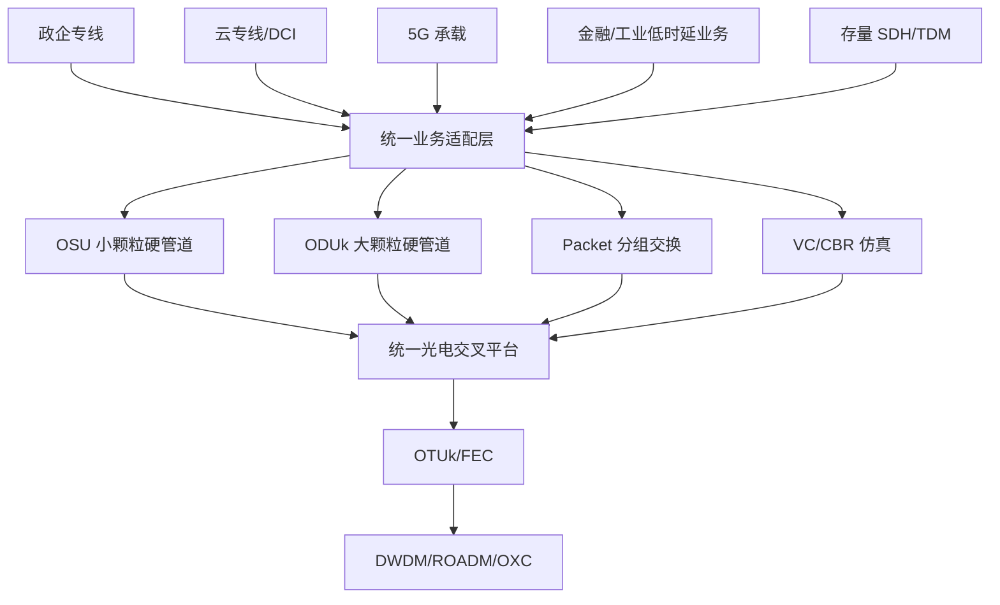
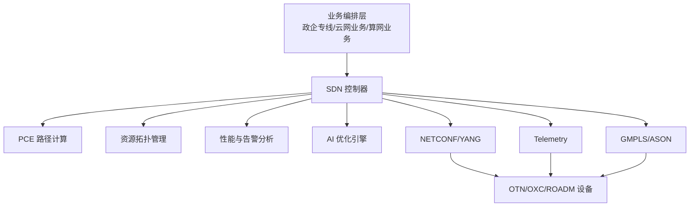
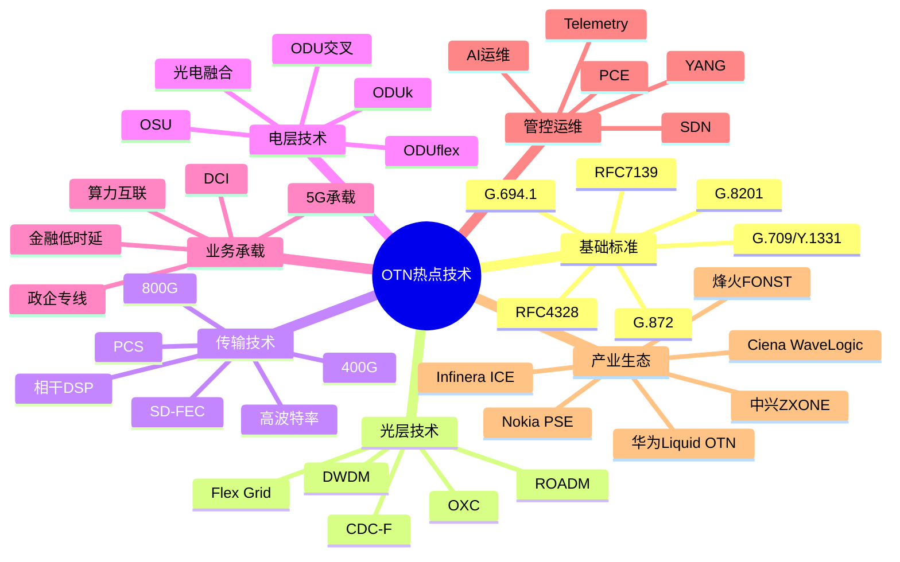
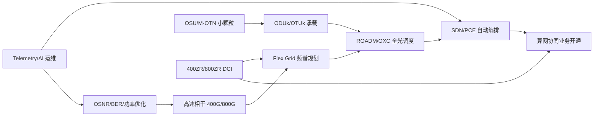

下面给出一个"系统化、层次化研究 OTN 热点技术"的技术框架。整体思路不是孤立看某一个 400G、OSU 或 OXC 技术点，而是按照 **标准体系—网络分层—关键技术—设备形态—运营商实践—演进趋势** 六个层次展开。作为传输网视角，OTN 的本质仍然是：**以 ITU-T G.709 定义的数字封装与开销体系为核心，以 G.872 定义的光传送网分层架构为基础，面向大带宽、低时延、高可靠和确定性承载的下一代光传送底座。**

---

## 1. 核心概念解析：OTN 热点技术到底围绕什么演进？

OTN，Optical Transport Network，光传送网，本质上是面向多业务承载的"数字化 WDM 传送体系"。它在传统 WDM 的大带宽基础上，引入了 **ODUk/OTUk/OPUk 封装、FEC 前向纠错、丰富开销、端到端性能监测、硬管道隔离和电层交叉调度**，从而实现对以太网、SDH、SAN、专线、5G 承载、云网互联等业务的高可靠传送。

可以用一句话概括 OTN 热点技术的主线：

> **从"波长大管道"向"全光调度 + 灵活颗粒 + 智能管控 + 超高速相干传输 + 算网协同光底座"演进。**

典型热点包括：

| 热点方向 | 技术关键词 | 解决的核心问题 |
|---|---|---|
| 高速相干传输 | 400G/800G/1.2T/1.6T、QPSK、16QAM、PCS、FEC | 单波容量、传输距离、频谱效率 |
| 灵活栅格 DWDM | Flex Grid、Super Channel、CDC-F ROADM | 频谱资源利用率和波长灵活调度 |
| OXC/ROADM | 全光交叉、无色无方向无冲突、光背板、LCoS WSS | 光层自动调度、减少人工跳纤 |
| OSU/M-OTN | Optical Service Unit、小颗粒硬切片、政企专线 | 2M~10G 小颗粒业务高效承载 |
| Liquid OTN/PeOTN/POTN | ODUk/Packet/OSU 融合交换 | 多业务统一承载和灵活调度 |
| SDN 管控 | GMPLS、YANG、NETCONF、Telemetry | 自动化开通、跨厂商协同、智能运维 |
| 算网全光底座 | 云间互联、东数西算、DCI、400ZR/800ZR | 算力中心间大带宽、低时延互联 |
| 智能运维 | AI、OSNR 预测、SOP 监测、光缆健康度 | 降低运维复杂度、提升可靠性 |

---

## 2. 标准与规范依据：研究 OTN 必须先抓住标准主干

系统研究 OTN 热点技术，不能只看设备商宣传口径，必须回到标准体系。核心标准如下。

### 2.1 ITU-T 标准体系

| 标准 | 作用 | 研究重点 |
|---|---|---|
| **ITU-T G.709/Y.1331** | OTN 接口、帧结构、ODUk/OTUk/OPUk、开销、复用映射 | OTN 数字封装和业务映射的基础 |
| **ITU-T G.872** | OTN 网络架构 | OCh、OMS、OTS 分层模型 |
| **ITU-T G.694.1** | DWDM 频谱栅格 | 固定栅格、灵活栅格 Flex Grid |
| **ITU-T G.694.2** | CWDM 波长栅格 | 城域低成本波分场景 |
| **ITU-T G.8201** | OTN 错误性能指标 | BBE、ES、SES 等性能劣化评估 |
| **G.709.x 系列** | 100G/200G/400G+、OSU 等增强演进 | 高速接口和小颗粒承载演进 |

### 2.2 IETF 与 SDN/控制平面标准

| 标准/方向 | 作用 |
|---|---|
| **RFC 4328** | 针对 G.709 OTN 的 GMPLS 信令扩展 |
| **RFC 7139** | OTN 架构下的 OSPF-TE 路由扩展 |
| **YANG 模型** | SDN 控制器与 OTN 设备之间的拓扑、业务、资源建模 |

### 2.3 OIF/IEEE 相关标准方向

| 组织 | 研究重点 |
|---|---|
| **OIF** | 400ZR、800ZR、1.6T 等相干模块互通，重点面向 DCI 场景 |
| **IEEE 802.3** | 100GBASE-R、400GBASE-R、800G 以太网客户侧接口 |

### 2.4 国内运营商与 CCSA 方向

国内 OTN 热点与运营商网络演进强相关：

- 中国移动：**SPN、CPE-OTN、NGOptN、算网全光底座**
- 中国电信：**全光网 2.0、M-OTN、OSU、STN**
- 中国联通：**CUBE-Net、PeOTN、接入型 OTN、算力时代全光底座**
- CCSA：围绕 **400G/800G 长距传输、ROADM/OXC、M-OTN、OSU、SDN 管控接口、YANG 模型** 推进国内行业标准化。

---

## 3. OTN 网络层次化技术框架

按照 ITU-T G.872 的思想，可以把 OTN 热点技术分为 **客户层、ODU 电层、OTU/光通道层、光复用段层、光传输段层、管控层** 六个层次。

对照前述八大热点方向，各技术落在六层架构的位置如下：

| 热点方向 | 主要层次 | 说明 |
|---|---|---|
| **高速相干传输** | OTU/光通道层（触及 OTS 层） | 调制格式、FEC、DSP、相干检测在 OTU/OCh 层；OSNR、跨段设计触及光传输段层 |
| **灵活栅格 DWDM** | 光复用段层 | Flex Grid、Super Channel 是波长复用与频谱规划的事，归属 OMS 层 |
| **OXC/ROADM** | 光复用段层 | 波长级全光调度，CDC-F 是 OMS 层核心能力 |
| **OSU/M-OTN** | ODU 电层 | OSU 是 ODU 体系内小颗粒增强，在 ODUk/ODUflex 之下做细粒度复用 |
| **Liquid OTN/PeOTN/POTN** | ODU 电层 | ODUk/Packet/OSU 统一交叉调度，核心在电层融合 |
| **SDN 管控** | 管控层 | NETCONF/YANG/Telemetry/PCE 横跨所有层做编排与建模 |
| **算网全光底座** | 跨层（端到端） | 从客户业务层到 OTS 层全栈协同，不是单一层技术 |
| **智能运维** | 管控层 | AI 预测、OSNR 趋势、光缆健康度归属管控/运维范畴 |

> 简单记：**高速相干看 OTU 层，Flex Grid/ROADM/OXC 看复用段层，OSU/PeOTN 看电层，SDN/AI 看管控层**。管控层横跨所有层做编排，电层做调度，光层做传输。

---

## 4. 第一层：高速相干传输技术

### 4.1 技术本质

高速相干传输是 OTN 骨干网扩容的核心。它通过相干检测、DSP 算法、高阶调制和强 FEC 技术，在有限光纤频谱上提高单波容量和频谱效率。

当前主流演进路径：

### 4.2 关键技术点

| 技术 | 作用 |
|---|---|
| 相干检测 | 同时恢复幅度、相位、偏振信息 |
| DSP | 补偿色散 CD、偏振模色散 PMD、非线性损伤 |
| 高阶调制 | QPSK、8QAM、16QAM、PCS-64QAM 等 |
| PCS 概率成型 | 在容量与传输距离之间做精细折中 |
| SD-FEC/OFEC | 提升 OSNR 容限，改善长距性能 |
| 高波特率 | 提高单载波容量，如 96Gbaud、130Gbaud 及以上 |

### 4.3 工程关注指标

研究高速相干传输时，不能只看"单波 800G"，还要看以下指标：

- **OSNR，Optical Signal-to-Noise Ratio，光信噪比**
- **Pre-FEC BER，纠前误码率**
- **Post-FEC BER，纠后误码率**
- **CD，Chromatic Dispersion，色度色散**
- **PMD，Polarization Mode Dispersion，偏振模色散**
- **Nonlinear Penalty，非线性代价**
- **光功率平坦度**
- **跨段长度与放大器级联数量**

### 4.4 产业实践

- 华为 OptiX OSN 9800：强调超高速 OTN、OXC、Liquid OTN。
- 中兴 ZXONE：强调 400G/800G 实时传输、PCS、相干 DSP。
- 烽火 FONST/F6000：强调光电融合、大容量 ODUk/OSU 交叉。
- Ciena WaveLogic：在超长距和海缆场景优势明显。
- Nokia PSE：在高性能相干 DSP 和系统集成方面具有技术积累。
- Infinera ICE：以 PIC 光子集成和多波长光引擎为特色。

---

## 5. 第二层：灵活栅格与超通道技术

### 5.1 技术本质

传统 DWDM 按 50GHz 或 100GHz 固定栅格规划波长，随着 400G/800G 速率提升，信号带宽变宽，固定栅格难以充分适配不同调制格式。**Flex Grid 灵活栅格** 基于 ITU-T G.694.1，可以按更细粒度分配频谱，提高频谱利用率。

### 5.2 固定栅格与灵活栅格对比

| 维度 | 固定栅格 | 灵活栅格 |
|---|---|---|
| 典型间隔 | 50GHz/100GHz | 12.5GHz 粒度或更灵活 |
| 适用场景 | 10G/40G/100G 传统 DWDM | 400G/800G/超通道 |
| 频谱效率 | 相对较低 | 较高 |
| 规划复杂度 | 较低 | 较高 |
| 对设备要求 | 普通 WSS/ROADM | 支持 Flex Grid 的 WSS/ROADM/OXC |

### 5.3 超通道 Super Channel

超通道通常把多个子载波作为一个逻辑大通道统一调度，适合 800G、1.2T、1.6T 以上场景。研究重点包括：

- 子载波间隔
- 调制格式选择
- 频谱碎片管理
- CDC-F ROADM 支持能力
- 端到端频谱连续性约束

---

## 6. 第三层：ROADM/OXC 全光交换技术

### 6.1 技术本质

ROADM/OXC 是 OTN 从"人工跳纤 WDM"走向"自动化全光网络"的关键。其目标是实现波长级、方向级、维度级的灵活调度，降低开通周期和运维复杂度。

### 6.2 ROADM 能力演进

### 6.3 关键能力解释

| 能力 | 含义 |
|---|---|
| Colorless，无色 | 任意客户侧端口可配置为任意波长 |
| Directionless，无方向 | 任意波长可去往任意线路方向 |
| Contentionless，无冲突 | 相同波长可在不同方向或端口并行使用 |
| Flex Grid，灵活栅格 | 可按业务速率动态分配频谱 |
| Optical Backplane，光背板 | 减少机内光纤连接，实现高集成全光交叉 |

### 6.4 OXC 工程价值

OXC，Optical Cross-Connect，全光交叉，主要价值包括：

1. **减少人工跳纤**
2. **提升波长调度效率**
3. **支持大维度 ROADM 节点**
4. **降低人为操作故障**
5. **适配算力网络动态调度**
6. **提升骨干网和城域核心网的全光化水平**

华为的 OXC 方案通常强调光背板和 LCoS WSS；中兴、烽火也强调光电混合交叉、CDC-F ROADM 与大容量 ODUk/OSU 统一调度。

---

## 7. 第四层：OSU 与 M-OTN 小颗粒硬管道技术

### 7.1 技术本质

OSU，Optical Service Unit，光业务单元，是面向小颗粒专线业务的 OTN 演进方向。传统 OTN 以 ODU0/ODU1/ODU2 等颗粒为主，对 2M、10M、100M、1G 等政企专线业务承载效率不够理想。OSU 的目标是提供更细颗粒、更低时延、更高带宽利用率的硬管道承载能力。

### 7.2 OSU 解决的问题

| 问题 | 传统 OTN 表现 | OSU/M-OTN 改进 |
|---|---|---|
| 小颗粒承载效率 | 低速业务占用较大 ODU 颗粒 | 更细粒度复用 |
| 专线时延 | 分组网可能存在排队时延 | 硬管道确定性时延 |
| 隔离性 | 分组承载依赖 QoS | 物理/时隙级硬隔离 |
| 运维体验 | 颗粒不够灵活 | 类 SDH 的精细化管理 |
| 政企接入成本 | 传统 OTN 设备成本高 | CPE-OTN/盒式 M-OTN 下沉 |

### 7.3 典型运营商实践

| 运营商 | 方向 | 特点 |
|---|---|---|
| 中国电信 | M-OTN、STN、OSU | 主打城域专线和小颗粒硬切片 |
| 中国移动 | CPE-OTN、NGOptN、SPN 协同 | 面向政企和算网全光底座 |
| 中国联通 | PeOTN、OTN-CPE | 分组增强型 OTN 与接入下沉 |

### 7.4 OSU 与传统 ODUk 的关系

从工程视角看，OSU 并不是简单替代 ODUk，而是在 OTN 体系内增强小颗粒承载能力，特别适合政企精品专线、金融专线、工业园区、算力接入等场景。

---

## 8. 第五层：光电融合与多业务统一承载

### 8.1 技术本质

传统网络中，SDH、MSTP、PTN、IP/MPLS、OTN、WDM 各自承载不同业务，网络层次复杂。当前热点是通过 **POTN、PeOTN、Liquid OTN、光电融合交叉** 实现多业务统一调度。

### 8.2 典型融合方式

| 技术形态 | 主要能力 |
|---|---|
| ODUk 电交叉 | 面向硬管道大颗粒业务 |
| OSU 交叉 | 面向小颗粒硬管道业务 |
| Packet 交换 | 面向统计复用和以太网业务 |
| VC/SDH 仿真 | 面向存量 TDM 业务 |
| ROADM/OXC 光交叉 | 面向波长级大带宽调度 |

### 8.3 统一承载架构

这类架构在设备商中有不同名称，例如：

- 华为：Liquid OTN、F5G 全光网、OptiX OSN 系列；
- 中兴：光电混合交叉、ZXONE；
- 烽火：智慧光网、FONST/F6000 光电融合平台；
- 中国联通：PeOTN；
- 中国电信：M-OTN；
- 中国移动：CPE-OTN、NGOptN。

---

## 9. 第六层：OTN SDN 智能管控与自动化运维

### 9.1 技术本质

OTN 网络长期面临"资源可视难、跨域开通慢、人工配置复杂、故障定位依赖专家经验"的问题。SDN 管控、YANG 模型和 AI 运维是解决这些问题的关键。

### 9.2 管控技术体系

| 技术 | 作用 |
|---|---|
| GMPLS | 传统控制平面，支持自动发现和路径建立 |
| OSPF-TE/RSVP-TE | 拓扑和资源通告、标签交换路径建立 |
| NETCONF/YANG | 设备建模、配置下发、状态获取 |
| Telemetry | 实时性能采集 |
| PCE | 路径计算，支持约束路由 |
| AI 运维 | 故障预测、光功率调优、OSNR 趋势分析 |

其中，IETF **RFC 4328** 和 **RFC 7139** 分别涉及 G.709 OTN 的 GMPLS 信令扩展和 OTN 架构下的 OSPF-TE 路由扩展。

### 9.3 智能管控架构

### 9.4 研究重点

- 多厂家设备 YANG 模型一致性；
- 跨域、跨层路径计算；
- 光层损伤感知路由；
- 业务 SLA 与底层资源联动；
- 故障根因定位，从告警相关性走向因果推理；
- 与算力调度平台联动，实现"算力在哪，光路到哪"。

---

## 10. 第七层：DCI、400ZR/800ZR 与算力网络光底座

### 10.1 DCI 场景变化

随着云计算、AI 大模型训练、东数西算、智算中心互联发展，DCI，Data Center Interconnect，数据中心互联成为 OTN/WDM 的高价值场景。

DCI 对传送网提出几个关键要求：

1. 大带宽：400G、800G、1.6T；
2. 低时延：跨城、跨省、区域算力池互联；
3. 快速开通：分钟级甚至秒级业务调度；
4. 低功耗：单位 bit 能耗下降；
5. 简化互联：ZR/ZR+ 可插拔相干模块；
6. 开放解耦：OIF 400ZR/800ZR 互通生态。

### 10.2 400ZR 与传统 OTN 长距相干的差异

| 维度 | 400ZR/800ZR | 传统长距 OTN 相干 |
|---|---|---|
| 主要场景 | 数据中心互联，短中距 | 城域、骨干、长距、超长距 |
| 形态 | 可插拔相干模块 | 线路板卡/子架平台 |
| 互通性 | 强调开放互通 | 厂商系统优化更强 |
| 传输距离 | 一般较短 | 可通过放大、FEC、DSP 支持长距 |
| 管理方式 | 更偏 IP/DC 设备接入 | 更偏传送网管控 |
| 典型标准组织 | OIF | ITU-T/OIF/设备商体系 |

### 10.3 算网全光底座

国内运营商的算网全光底座主要强调：

- 骨干 400G/800G 大规模部署；
- 城域 OXC/ROADM 下沉；
- 云网边端多级节点互联；
- OTN/OSU 提供确定性专线；
- 与算力调度、云管平台协同；
- 面向 AI 训练集群和智算中心构建高可靠光联接。

中国移动提出的算网全光底座、中国电信全光网 2.0、中国联通 CUBE-Net，本质上都是围绕"算力时代的确定性光连接"展开。

---

## 11. OTN 热点技术的层次化研究地图

可以把研究对象按"从底向上"的方式组织为如下地图。

---

## 12. 各热点技术的成熟度与研究优先级

| 技术方向 | 成熟度 | 研究优先级 | 说明 |
|---|---:|---:|---|
| 100G/200G OTN | 高 | 中 | 现网成熟，重点在存量演进 |
| 400G 长距 OTN | 高 | 高 | 骨干网规模商用核心 |
| 800G OTN | 中高 | 高 | 正处于规模部署和优化阶段 |
| 1.2T/1.6T 相干 | 中 | 中高 | 面向未来骨干和 DCI |
| Flex Grid | 中高 | 高 | 高速波分必备能力 |
| CDC-F ROADM | 中高 | 高 | 城域/骨干全光调度核心 |
| OXC | 中高 | 高 | 大节点、高维度调度方向 |
| OSU/M-OTN | 中高 | 高 | 政企专线和城域 OTN 热点 |
| PeOTN/POTN | 高 | 中高 | 多业务融合承载 |
| SDN/YANG 管控 | 中 | 高 | 跨厂家解耦仍是难点 |
| AI 光网络运维 | 中 | 中高 | 从辅助分析走向闭环调优 |
| 400ZR/800ZR | 中高 | 高 | DCI 场景增长明显 |
| CPO/LPO 光电共封装 | 较早期 | 中 | 更偏数据中心内部和未来光互联 |

---

## 13. 关键技术之间的关系：不要割裂研究

OTN 热点技术之间不是孤立关系，而是相互耦合。例如：

- 800G 需要 Flex Grid 支持更宽频谱；
- Flex Grid 需要 ROADM/OXC 支持灵活频谱调度；
- OXC 需要 SDN 控制器实现自动编排；
- SDN 要依赖准确的光层性能模型，包括 OSNR、功率、色散、非线性代价；
- OSU 需要 ODUk/OTUk 体系承载，同时依赖城域 OTN 设备下沉；
- DCI 需要 400ZR/800ZR 与传统 OTN/WDM 协同；
- 算网协同需要光层、OTN 电层、IP 层、云平台之间联动。

可以用下图表示：

---

## 14. 现网工程研究建议

如果面向实际网络规划、设备选型或技术路线研究，建议按以下路径展开。

### 14.1 第一阶段：标准与架构研究

重点掌握：

1. ITU-T G.709 的 OPUk/ODUk/OTUk 结构；
2. ITU-T G.872 的 OCh/OMS/OTS 分层；
3. ITU-T G.694.1 的 DWDM Flex Grid；
4. G.8201 的性能劣化评价指标；
5. GMPLS 与 YANG 管控模型。

### 14.2 第二阶段：高速线路系统研究

重点研究：

- 400G/800G 调制格式；
- OSNR 容限；
- FEC 增益；
- 跨距设计；
- 放大器配置；
- 光功率均衡；
- ROADM 穿通代价；
- 非线性损伤。

### 14.3 第三阶段：OXC/ROADM 组网研究

重点研究：

- CDC-F ROADM 架构；
- OXC 节点维度；
- WSS 插损；
- 光层保护恢复；
- 波长/频谱连续性；
- 光层与电层协同调度；
- 骨干、城域核心、城域汇聚不同层级的部署策略。

### 14.4 第四阶段：OSU/M-OTN 专线承载研究

重点研究：

- OSU 颗粒和复用机制；
- 小颗粒业务承载效率；
- 与 ODUk/ODUflex 的关系；
- 端到端硬管道保护；
- 政企 CPE-OTN 设备形态；
- 与 IP/MPLS VPN、SRv6、SPN 的边界。

### 14.5 第五阶段：SDN 与智能运维研究

重点研究：

- 业务自动开通；
- 跨域路径计算；
- 光层资源可视；
- 告警相关性分析；
- 预测性维护；
- AI 辅助光功率调优；
- 多厂商解耦与 YANG 模型统一。

---

## 15. 面向不同场景的技术选型建议

| 场景 | 推荐技术组合 | 说明 |
|---|---|---|
| 国家骨干网扩容 | 400G/800G + Flex Grid + OXC | 优先考虑长距性能、OSNR、频谱效率 |
| 省干/城域核心 | 400G + ROADM/OXC + ODUk 交叉 | 兼顾大带宽和多方向调度 |
| 城域政企专线 | M-OTN + OSU + CPE-OTN | 强调小颗粒、低时延、硬隔离 |
| 云专线/DCI | 400ZR/800ZR + OTN/WDM | 短中距可用 ZR，长距仍需 OTN 线路系统 |
| 金融低时延专线 | OTN 硬管道 + 1+1 保护 | 关注时延、抖动、保护倒换时间 |
| 5G 承载 | SPN/OTN 协同 | 移动场景常见，强调切片和可靠性 |
| 算力网络 | OXC + 400G/800G + SDN 编排 | 面向算力节点动态互联 |
| 存量 SDH 迁移 | PeOTN/POTN + OSU/ODUk | 兼顾 TDM 仿真和新业务承载 |

---

## 16. 未来演进趋势判断

从传输专家视角看，OTN 后续演进大概率沿着以下方向发展：

1. **单波速率继续提升**  
   从 400G/800G 走向 1.2T、1.6T，核心依赖高波特率器件、强 DSP、PCS 和更高性能 FEC。

2. **光层更加自动化**  
   OXC、CDC-F ROADM、Flex Grid 会成为大中型节点的标配能力，减少人工连纤。

3. **电层颗粒更加灵活**  
   ODUflex、OSU、Liquid OTN、M-OTN 会共同支撑从 2M 到 100G/400G 的多颗粒承载。

4. **管控从网管走向智能编排**  
   传统 EMS/NMS 会向 SDN Controller、PCE、Telemetry、AI 运维平台演进。

5. **OTN 与 IP/云/算力平台深度协同**  
   未来不是单独建一张 OTN 网，而是让 OTN 成为云网、算网、智算中心互联的确定性光底座。

6. **开放解耦与设备商能力并存**  
   400ZR/800ZR、YANG、OpenConfig 等推动开放；但长距复杂场景仍强依赖设备商系统级优化能力。

7. **绿色低碳成为硬指标**  
   单 bit 功耗、机房空间、散热能力、光电转换次数都会成为网络规划的重要约束。

---

## 17. 总结：建议的 OTN 热点技术研究框架

如果要系统化研究 OTN 热点技术，建议形成如下"六层一体"的研究框架：

1. **标准层**：G.709、G.872、G.694.1、G.8201、RFC 4328、RFC 7139；
2. **光层**：DWDM、Flex Grid、ROADM、OXC、CDC-F；
3. **线路层**：400G/800G/1.6T、相干 DSP、PCS、FEC、OSNR；
4. **电层**：ODUk、ODUflex、OSU、Liquid OTN、PeOTN、POTN；
5. **业务层**：政企专线、DCI、5G、金融低时延、算力互联；
6. **管控层**：SDN、YANG、Telemetry、PCE、AI 运维。

一句话结论：

> **OTN 热点技术的主战场，已经从单纯"提升波长容量"，转向"高速相干 + 全光调度 + 灵活颗粒 + 智能管控 + 算网协同"的综合体系竞争。**
