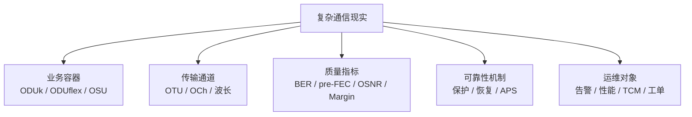
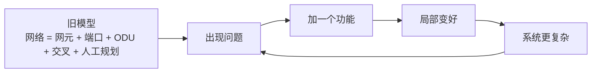

# OTN 创新的本质：从硬管道到确定性连接服务

通信设备领域的创新，最难的地方往往不是再做一个更高速率的端口、再加一种保护方式、再做一个更复杂的网管页面。

这些当然重要。但它们大多还是在同一个问题里继续优化。

真正难的创新，是把问题本身换掉：

> **OTN 不只是设备能力，而可能是一种确定性连接服务能力。**

这句话听起来有点抽象。我们从一个更底层的框架开始讲。

---

## 一、OTN 本身就是一种压缩

现实中的通信网络非常复杂。

一张承载网里同时存在：

- 客户业务
- 带宽颗粒
- SLA
- 时延
- 保护倒换
- 光纤损耗
- 色散
- PMD
- OSNR
- 非线性
- 波长资源
- 交叉资源
- 板卡资源
- 告警
- 性能
- 网管操作
- 运维流程

如果这些东西原样暴露出来，网络无法规划、无法交付、无法计费、无法运维。

OTN 的伟大之处在于，它把这些复杂东西压缩成了一套稳定对象：



所以 OTN 不只是传输技术。它是一套**把复杂通信现实压缩成可规划、可交付、可运维、可计费对象的方法**。

这个视角很重要。

因为理解了这一点，才能理解 OTN 的创新到底在改什么。

---

## 二、传统 OTN 的旧压缩：确定性硬管道

传统 OTN 最核心的压缩方式，可以概括成一句话：

> **把复杂业务压缩成确定性的硬管道。**

客户要的是可靠连接。OTN 把它压成：

```text
客户业务
    ↓
ODUk / ODUflex / OSU 容器
    ↓
交叉连接 / 波长 / 光通道
    ↓
确定带宽、确定隔离、确定保护、确定 SLA
```

这套压缩非常成功。

金融专线需要确定性。政企专线需要隔离。骨干传输需要稳定。运营商需要可控。运维团队需要清晰对象。采购和标准也需要明确规格。

所以传统 OTN 的旧范式不是错的。恰恰相反，它太成功了。

也正因为它太成功，它容易变成一种看不见的常识：

> 网络就是网元、端口、链路、ODU 容器、交叉、保护、告警。

当一套表示方式足够好，人就会透过它看世界，忘了它只是一套表示方式。

这就是通信设备领域创新最难的地方：**不是旧模型不好，而是旧模型太好，以至于我们很难意识到它只是模型。**

---

## 三、OTN 里的“本轮”：不断打补丁的局部改进

在地心说里，古人用“均轮 + 本轮”解释行星运动。

简单说：行星不是直接绕地球转，而是在一个小圆上转；这个小圆的圆心再沿着一个大圆绕地球转。这样就能解释行星为什么有时会“逆行”。

发现误差怎么办？

再加一个本轮。

还有误差？

再加一个。

每加一个，本地解释力都变好一点。但沿着这条路走下去，永远走不到日心说。

OTN 领域也有自己的“本轮”。

```text
速率不够 → 上 400G / 800G
颗粒不合适 → 再定义一种新颗粒
业务开通慢 → 加自动化脚本
调度复杂 → 再加一层网管模板
告警太多 → 加告警关联规则
资源利用率低 → 加规划工具
跨层协同差 → 再叠一个控制器
保护不够灵活 → 再加一种保护方案
```

这些东西不是没用。它们都有用。

问题在于：它们很多时候仍然是在旧压缩里继续打补丁。



这就是典型的局部优化回路。

每一步都合理。每一步都有收益。每一步都像进步。

但它不一定会带你走向新的范式。

---

## 四、OTN 当前面对的异常信号

一个旧范式什么时候会被挑战？

不是它突然不行了，而是它开始不断遇到解释成本越来越高的异常。

OTN 现在遇到的异常，大概有五类。

---

### 1. 业务从长期稳定，变成短周期、弹性、多样化

过去很多专线一开就是几年。带宽、路径、SLA 都相对稳定。

现在云、AI、算力调度、数据中心互联、企业上云，让业务形态变得更动态：

```text
今天要 10G
明天要 100G
下个月迁到另一个云区
某个 AI 训练任务需要临时大带宽
某个政企客户只要小颗粒硬隔离
```

如果所有东西都继续压成传统大颗粒硬管道，就会显得不够细、不够快、不够弹性。

---

### 2. 网络从“传输资源”，变成“算网资源的一部分”

过去 OTN 可以相对独立：

```text
我负责把 A 点比特可靠送到 B 点。
```

但算力网络、东数西算、AI 集群、云专线之后，业务要的不只是带宽：

```text
带宽
时延
抖动
可靠性
算力位置
成本
能耗
多云协同
```

这时候 OTN 不能只被压缩成“管道”。

它可能要被重新压缩成：

> **算力系统里的确定性连接资源。**

这不是简单换个名字，而是表示方式变了。

---

### 3. 运维从专家经验，走向闭环系统

传统运维高度依赖专家：

```text
看告警
看性能
看光功率
看误码
看倒换
看工单
靠经验定位
```

专家经验本身也是一种压缩：一个老工程师把多年经验压成直觉。

但网络越来越大，速率越来越高，层次越来越多，人脑压缩会遇到带宽上限。

未来的运维创新，不应该只是“再做一个告警页面”，而可能是：


也就是从“人工经验压缩”，变成“机器闭环压缩”。

---

### 4. 设备从封闭盒子，走向开放组件

传统通信设备是高度集成盒子：

```text
机框
板卡
客户侧
线路侧
交叉
网管
控制协议
全部由一家封装
```

这带来稳定、可靠、责任清晰。

但它也形成一种旧压缩：

```text
设备 = 厂家黑盒
网络 = 多个黑盒拼起来
```

coherent pluggable、Open Line System、IPoDWDM、开放 API、白盒传输，都在挑战这个压缩。

新的压缩可能是：

```text
网络 = 可组合的开放光电组件 + 软件控制系统
```

但这里真正难的不是技术，而是责任模型：

```text
谁保证性能？
谁负责故障？
谁处理互通？
谁承担生命周期风险？
```

所以开放不是简单“拆盒子”。开放真正要重构的是**运营模型和责任边界**。

---

### 5. 评价函数从容量优先，变成能效和生命周期优先

过去很长时间，通信设备创新的主线是：

```text
10G → 40G → 100G → 200G → 400G → 800G
```

这条线仍然重要。

但未来另一个约束会越来越硬：

```text
每 bit 能耗
机房功耗
散热
光模块功耗
整网能效
生命周期成本
```

旧压缩是：

```text
性能 = 速率 / 容量 / 距离
```

新压缩可能是：

```text
性能 = 容量 × 可靠性 × 能效 × 自动化 × 生命周期成本
```

这就是换问题。

---

## 五、五个可能的创新方向

基于上面的异常，OTN 的创新不应该只问“还能不能更大容量”。

更应该问：**网络到底应该被重新压缩成什么对象？**

---

### 方向一：从硬管道到确定性切片

传统 OTN 的强项是硬隔离和确定性。

未来的问题是：

```text
既要硬隔离
又要小颗粒
又要快速开通
又要灵活调度
又要可计费
```

fgOTN、OSU 这类细粒度承载，真正的创新点不只是“颗粒变小”。

它更深的意义是：

> **把过去只有大客户、大带宽才能享受的确定性承载，压缩成更小颗粒、更自动化、更可运营的产品。**

如果只是技术上支持小颗粒，这只是功能增强。

如果它改变了政企专线、云专线、行业专网的交付方式，那才是创新。

---

### 方向二：从网元视角到业务意图视角

传统网管的对象是：

```text
网元
板卡
端口
交叉
ODU
波长
链路
```

这是工程师友好的压缩。

但客户真正想表达的是：

```text
我要 A 到 B
带宽多少
时延多少
可靠性多少
是否隔离
什么时候开通
多少钱
```

所以更高一级的创新是：


这不是简单 SDN 控制器。

真正难的是：**把网元级压缩，升级成业务意图级压缩。**

---

### 方向三：从静态 Margin 到动态光层资源

传统光层规划通常比较保守：

```text
按最坏情况留余量
按人工经验规划
按固定模式配置
```

但相干 DSP、实时遥测、可调调制格式、flex-grid、CDC-F ROADM 出来之后，光层不再只是固定物理层。

它可以被看成一个动态资源系统：

```text
当前 OSNR
当前非线性风险
当前频谱占用
当前链路老化
当前误码趋势
    ↓
动态选择调制、FEC、波长、路径、Margin
```

这类创新的本质是：

> **把光层从静态工程经验，重新压缩成可观测、可计算、可调度的资源池。**

---

### 方向四：从设备黑盒到开放组件

开放组件不只是把盒子拆开。

如果只是“我也支持开放 API”，但故障定位、性能保证、生命周期责任仍然模糊，那不是完整创新。

真正的开放创新需要重新压缩三件事：

```text
组件能力怎么表达？
组件之间怎么互通？
出了问题谁负责？
```

也就是说：

> **开放的核心不是接口，而是能力模型、互通模型和责任模型。**

通信设备行业和互联网行业最大的不同就在这里：互联网服务可以快速试错，通信设备必须长期稳定。

开放不能牺牲责任清晰。

---

### 方向五：从容量设备到确定性连接服务

这是我认为最关键的方向。

传统问题是：

```text
这台设备有多少 T 交叉？
多少个 400G 端口？
支持多少保护方式？
```

新问题可能是：

```text
这个网络能不能像云资源一样被调用？
业务能不能只表达意图？
底层能不能自动组合光、电、保护、路由和监控？
SLA 能不能持续验证？
故障能不能自动闭环？
```

这时候 OTN 的核心资产就不只是某块板卡，而是：

```text
确定性资源抽象能力
多层协同能力
SLA 可验证能力
自动闭环能力
生命周期运营能力
```

一句话：

> **OTN 下一阶段真正的创新，不一定是“更大容量的 OTN”，而可能是“把 OTN 从设备能力，重新压缩成确定性连接服务能力”。**

---

## 六、通信设备创新的特殊约束

通信设备和互联网产品不一样。

互联网产品可以：

```text
快速试错
小步迭代
失败回滚
```

通信设备不行。

通信设备面对的是：

```text
标准
互通
现网兼容
长期稳定
五个九可靠性
生命周期 10 年+
运营商采购
故障责任
安全合规
```

所以 OTN 的创新不能是“推倒重来”。

真正能落地的创新，必须满足一个条件：

> **新压缩要能把旧压缩包含为特例。**

相对论没有把牛顿力学扔掉，而是把牛顿变成低速、弱引力条件下的特例。

OTN 的新范式也必须包含旧 OTN：

```text
传统 ODUk 专线仍然能跑
传统保护仍然能用
传统网管仍然能接
传统运维仍然能理解
老客户业务不能断
```

否则不是创新，是事故。

---

## 七、判断一个 OTN 创新是否真正成立

可以用五个问题判断。

### 1. 它是在加本轮，还是在换坐标系？

如果只是多一个功能、多一个模板、多一个告警规则，可能是必要改进，但不一定是范式创新。

如果它改变了网络被表达、被调用、被运营的方式，那才可能是换坐标系。

---

### 2. 它改变的是设备能力，还是服务能力？

设备能力问：

```text
这台盒子能做什么？
```

服务能力问：

```text
这个网络能向业务承诺什么？
```

OTN 的未来价值，很可能更多来自后者。

---

### 3. 它有没有新的抽象对象？

真正的创新通常会带来新对象：

```text
确定性切片
连接意图
光层资源池
SLA 可验证连接
数字孪生网络
```

如果没有新对象，只是在旧对象上加字段，创新深度通常有限。

---

### 4. 它有没有闭环？

没有反馈闭环的自动化，很容易变成“高级脚本”。

真正的系统创新应该是：

```text
感知 → 决策 → 执行 → 验证 → 修正
```

---

### 5. 它能不能兼容旧世界？

通信设备行业里，不能兼容旧世界的创新，落地成本极高。

最好的创新不是把旧体系推翻，而是让旧体系在新体系里变成一个特例。

---

## 收束

OTN 的旧压缩，是把复杂业务压成确定性的硬管道。

这套压缩非常成功。它支撑了运营商网络、政企专线、金融专线、骨干承载，也塑造了通信设备行业的标准、网管、运维、采购和责任模型。

但下一阶段的挑战正在变化：业务更动态，颗粒更细，算网更融合，能耗压力更强，运维更复杂，开放组件带来新的责任边界。

所以 OTN 的创新，可能不是继续问：

```text
怎样做更大容量的设备？
```

而是问：

```text
怎样把 OTN 重新压缩成一种可调用、可验证、可运营的确定性连接服务？
```

这就是从“硬管道”到“确定性连接服务”的跃迁。

> **硬管道解决的是连接是否可靠。确定性连接服务解决的是业务能否按意图、按 SLA、按生命周期持续获得可靠连接。**

如果这个问题成立，OTN 的创新主线就会从设备指标，转向资源抽象、业务意图、动态光层、自动闭环、能效和生命周期运营。

这不是否定传统 OTN。

恰恰相反，真正好的新范式，必须把传统 OTN 包含进去。

因为在通信设备领域，最好的创新不是拆掉旧世界，而是让旧世界在新系统里继续稳定运行，同时打开新的可能。

---

*用到的思维框架：第一性原理、系统思维、压缩框架、地图-领土、反馈回路、创新范式迁移。*
