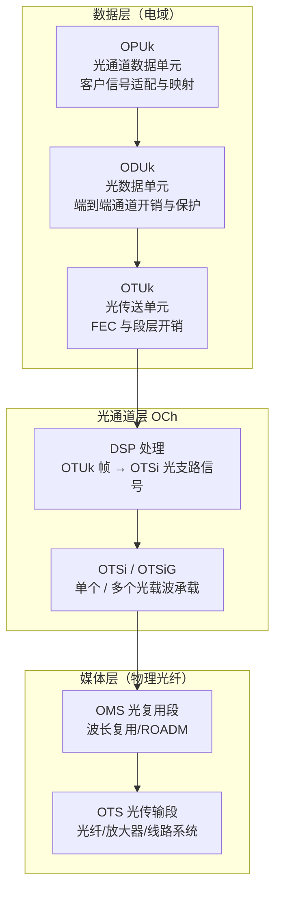
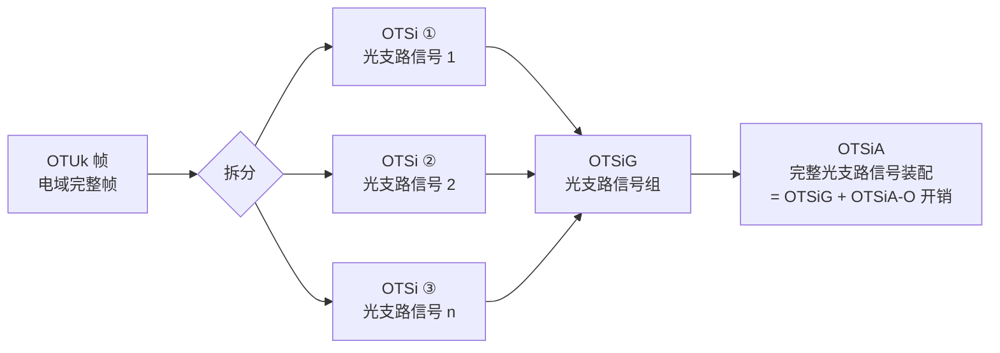
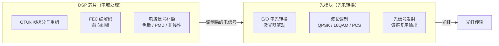
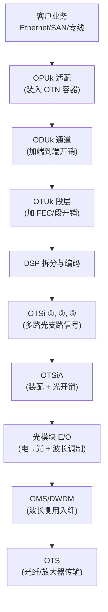

理解 OTN 从电域到光域的完整链路，关键在于三个概念的交汇：**OTSiA 光支路信号装配**、**OTN 三层协议架构**、以及 **DSP 芯片与光模块的功能边界**。这篇文章把手写笔记中的要点整理成一份可查阅的技术速览。

---

## 1. OTN 三层协议架构：数据在哪里变成光？

先从结构入手。OTN 从逻辑到物理可以分为三层：

| 层次 | 英文 | 核心单元 | 做什么 |
|---|---|---|---|
| **数据层（电域）** | Digital Layer | OPUk → ODUk → OTUk | 客户信号封装、通道开销、FEC 编码 |
| **光通道层** | OCh (Optical Channel) | OTSi / OTSiG / OTSiA | 将电域 OTUk 帧转换为光支路信号 |
| **媒体层** | Media Layer | OMS → OTS | 波长复用、光纤传输、放大 |

关键理解：**数据层处理比特，光信号层完成电到光的形态转换，媒体层负责把光送到对端。**

---

## 2. OTSiA 详解：光支路信号装配是什么？

### 2.1 为什么需要 OTSiA？

传统低速 OTN（100G 以下）中，一个 OTUk 帧直接调制到一个波长上，关系是 1:1。

到了 400G/800G/1.6T 时代，单波长容量超过 100G，出现了两个新情况：

1. **超通道（Super Channel）**：一个高速 OTUk 需要拆分到多个子载波上并行传输
2. **灵活颗粒（FlexO）**：承载方式从"一个 OTUk 占一个波长"变成"多个光支路信号灵活组合"

OTSiA 就是用来描述这个"组装过程"的标准概念。

### 2.2 从 OTUk 到 OTSiA 的映射过程

核心概念对照：

| 术语 | 全称 | 含义 |
|---|---|---|
| **OTSi** | Optical Tributary Signal | 单个调制光载波承载的光信号，是最小光信号单元 |
| **OTSiG** | Optical Tributary Signal Group | 多个 OTSi 的组合，对应超通道场景下的一组并行子载波 |
| **OTSiA** | Optical Tributary Signal Assembly | 完整的装配结果 = OTSiG + OTSiA-O 光开销 |
| **OTSiA-O** | OTSiA Overhead | 光支路信号装配的开销信息，用于对端还原与管理 |

### 2.3 一句话总结

> OTSiA 就是把电域 OTUk 帧拆成多路光支路信号、加上光层开销、再组装成一个完整光信号标准装配的过程。它是 OCh 光通道层的核心功能，也是电域和光域的"翻译接口"。

---

## 3. DSP 芯片 vs 光模块：功能边界在哪里？

这是工程实现中最容易混淆的问题。手写笔记画了一条清晰的界线：

### 3.1 DSP 芯片——数字域"大脑"

| 功能 | 做什么 |
|---|---|
| **OTUk 帧拆分与重组** | 将高速 OTUk 帧按子载波拆成多路低速流发给调制器，收端反向还原 |
| **FEC 编解码** | 发端添加前向纠错冗余（SD-FEC/OFEC），收端解码恢复误码 |
| **电域信号补偿** | 实时补偿色散（CD）、偏振模色散（PMD）、非线性损伤，这是 DSP 的核心价值 |

DSP 处理的对象是 **数字电信号**，输入是 OTUk 帧，输出是驱动光调制器的多路电信号。

### 3.2 光模块——物理域"手脚"

| 功能 | 做什么 |
|---|---|
| **E/O 电光转换** | 将 DSP 输出的电信号驱动 Mach-Zehnder 调制器，生成调制光 |
| **波长调制** | 根据调制格式（QPSK/QAM/PCS）将电信号调制到激光器输出的指定波长上 |
| **偏振复用** | 两路独立偏振态各承载一部分数据，双倍容量 |

光模块处理的对象是 **模拟光信号**，输入是 DSP 的电驱动信号，输出是耦合到光纤的调制光波。

### 3.3 为什么一定要分开？

| 维度 | DSP 芯片 | 光模块 |
|---|---|---|
| **处理域** | 电域（数字 + 模拟混合） | 光域 |
| **演进路径** | 跟随 CMOS 工艺，算法密集 | 跟随光子集成（PIC）、III-V 族工艺 |
| **升级方式** | 固件/FW 升级算法 | 物理更换模块 |
| **关键厂商** | 设备商自研或 Broadcom/Marvell | Lumentum/Coherent/旭创/光迅 |
| **功耗占比** | 大头（复杂算法消耗大） | 激光器 + 驱动功耗 |

二者之间通过 **高速 SerDes 电接口** 连接。DSP 算得出来但光模块调制不上去，没用；光模块能发但 DSP 不补偿，收端解不出来——**必须配套设计**。

---

## 4. 全链路串联：从客户数据到光纤出去

把以上三个概念串起来，一次完整的 OTN 发送流程如下：

收端正好倒过来：OTS → OMS → 光模块 O/E → DSP 解码/补偿 → OTUk → ODUk → OPUk → 客户业务。

---

## 5. 关键标准索引

| 标准 | 涉及内容 |
|---|---|
| **ITU-T G.872** | OTN 架构，定义 OCh/OMS/OTS 分层，以及 OTSi/OTSiA 概念 |
| **ITU-T G.709/Y.1331** | OTUk/ODUk/OPUk 帧结构与复用映射 |
| **ITU-T G.709.1 (FlexO)** | 灵活 OTN 接口，OTSiG 多载波承载规范 |
| **ITU-T G.694.1** | DWDM 频谱栅格（灵活栅格 Flex Grid 的基础） |

---

## 6. 一句话记住

> **数据层管比特（OPU/ODU/OTU），光通道层做翻译（DSP → OTSiA），媒体层跑光纤（OMS/OTS）。DSP 是大脑在上游算，光模块是手脚在下游发。**
